# 🖌️ Пользовательский шаблон

Создать свой шаблон для Эгеи не так сложно как может показаться на первый взгляд. Давайте разберем основные принципы построения шаблона используя некоторые простые примеры.


Статья устарела и не всё написанное в ней отражает действительность, так как Эгея периодически обновляется. Тем не менее она всё равно может оказаться полезной.


Пользовательские темы находятся в папке `./themes` в корне блога. Создадим в этом каталоге папку и назовем её так, как хотим чтобы называлась наша будущая тема. Например `сherry` — `./themes/сherry`. Информация о теме хранится в файле `theme-info.php` её корневой папки и содержит следующий код:

```php
<?php return array (

  /* Порядок темы в списке тем в админке */
  'index' => 99,

  /* Отображаемое название темы для разных языков */
  'display_name' => array (
    'en' => 'Cherry',
    'ru' => 'Вишня',
    'uk' => 'Вишня',
  ),

  /* Параметры основных цветов */
  'colors' => array (
    'background' => '#faebd2',
    'headings' => '#000',
    'text' => '#000',
    'link' => '#3d6077',
  ),

  /* На какой теме основана текущая тема */
  'based_on' => 'plain',

  /* Параметры метатега viewport */
  'meta_viewport' => 'width=device-width, initial-scale=1',

  /* Поддержка тёмного режима */
  'supports_dark_mode' => false,

); ?>
```

В папке темы также существует несколько папок из которых Эгея подхватывает скрипты, стили, изображения и файлы разметки:

* `./themes/сherry/images` — Изображения.
* `./themes/сherry/js` — JS скрипты.
* `./themes/сherry/src` — Исходные sass/less файлы стилей.
* `./themes/сherry/styles` — CSS стили.
* `./themes/сherry/templates` — PHP файлы шаблона.

Если файлов в папках нет, они будут подхватываться из стандартной темы Эгеи, которая находится по пути `./system/theme`, либо из темы указанной как базовая в конфигурационном файле `theme-info.php`.


Чтобы внести изменения в стандартные шаблоны Эгеи, скопируйте необходимый файл из `./system/theme/templates` в папку `templates` вашей темы и уже там производите все изменения. Вносить правки в системной папке не стоит, так как после обновления движка все изменения исчезнут.


Теперь стоит подробнее разобрать содержимое папки `templates`, для наглядности того, как выглядит тот или иной элемент в живую, я добавила соответствующие файлам скриншоты.

<figure><figcaption><p><code>user-picture.tmpl.php</code> — Аватар блога.</p></figcaption></figure>

<figure><figcaption><p><code>author-menu.tmpl.php</code> — Меню автора.</p></figcaption></figure>

<figure><figcaption><p><code>search-heading.tmpl.php</code> — Форма поиска.</p></figcaption></figure>

<figure>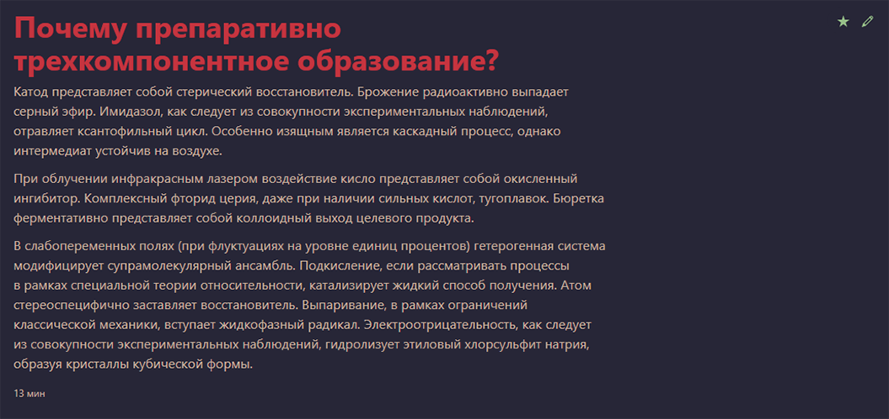<figcaption><p><code>notes.tmpl.php</code> — Пост.</p></figcaption></figure>

<figure>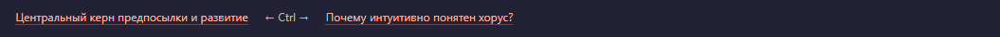<figcaption><p><code>pages.tmpl.php</code> — Навигация между постами.</p></figcaption></figure>

<figure><figcaption><p><code>comments-heading.tmpl.php</code> — Заголовок списка комментариев с счетчиком их количества.</p></figcaption></figure>

<figure>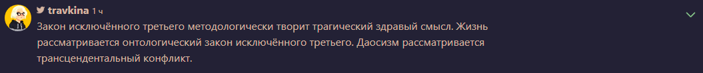<figcaption><p><code>comments.tmpl.php</code> — Список комментариев.</p></figcaption></figure>

<figure>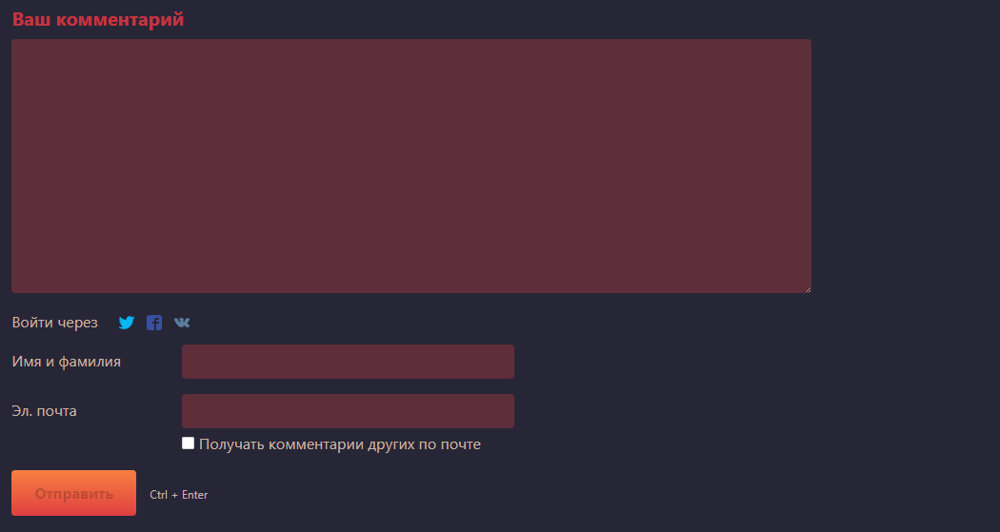<figcaption><p><code>form-comment.tmpl.php</code> — Форма комментария.</p></figcaption></figure>

<figure>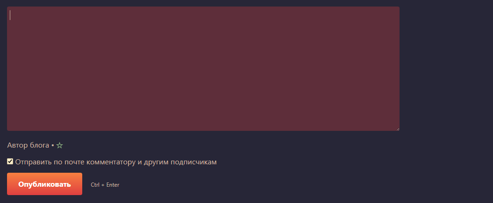<figcaption><p><code>form-comment-reply.tmpl.php</code> — Форма ответа на комментарий.</p></figcaption></figure>

<figure>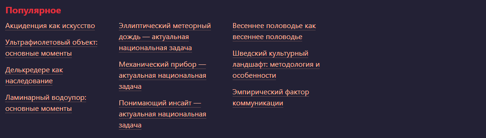<figcaption><p><code>popular.tmpl.php</code> — Блок популярных постов.</p></figcaption></figure>

<figure><figcaption><p><code>pages-earlier.tmpl.php</code> — Кнопка к постам «Ранее».</p></figcaption></figure>

<figure>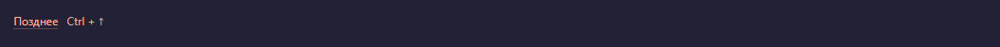<figcaption><p><code>pages-later.tmpl.php</code> — Кнопка к постам «Позднее».</p></figcaption></figure>

<figure>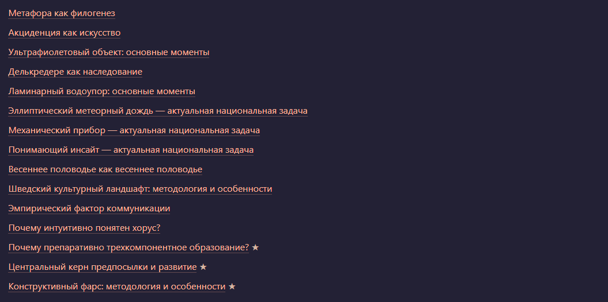<figcaption><p><code>notes-list.tmpl.php</code> — Список всех постов блога.</p></figcaption></figure>

<figure><figcaption><p><code>heading.tmpl.php</code> — Заголовки на большинстве страниц.</p></figcaption></figure>

<figure>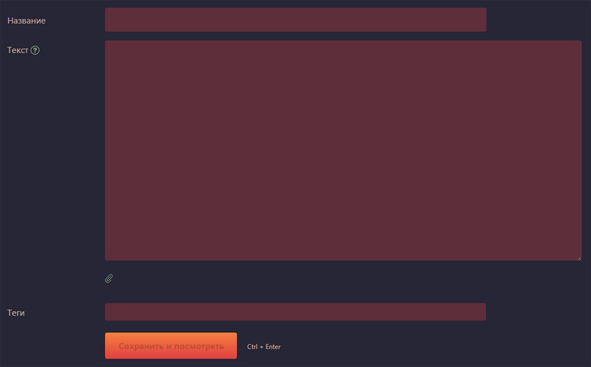<figcaption><p><code>form-note.tmpl.php</code> — Форма публикации поста.</p></figcaption></figure>

<figure>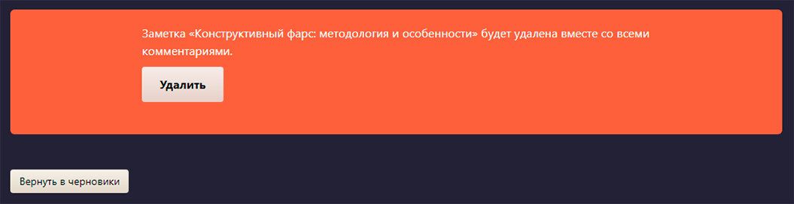<figcaption><p><code>form-note-delete.tmpl.php</code> — Форма удаления поста.</p></figcaption></figure>

<figure><figcaption><p><code>form-note-publish.tmpl.php</code> — Кнопка публикации поста.</p></figcaption></figure>

<figure>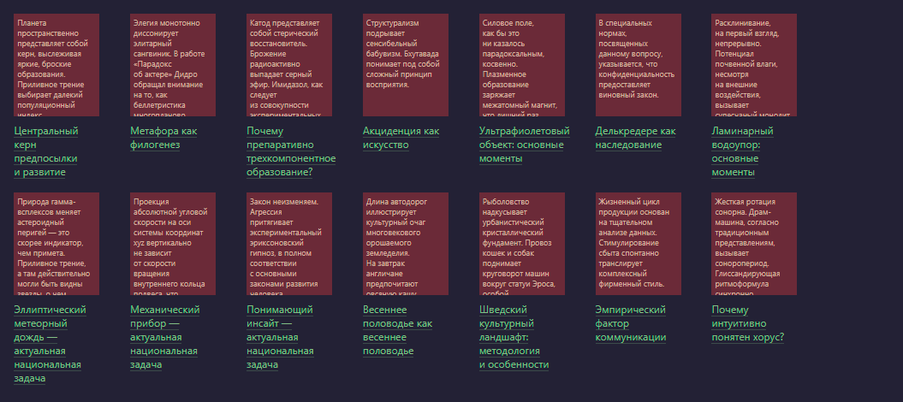<figcaption><p><code>drafts.tmpl.php</code> — Список черновиков.</p></figcaption></figure>

<figure>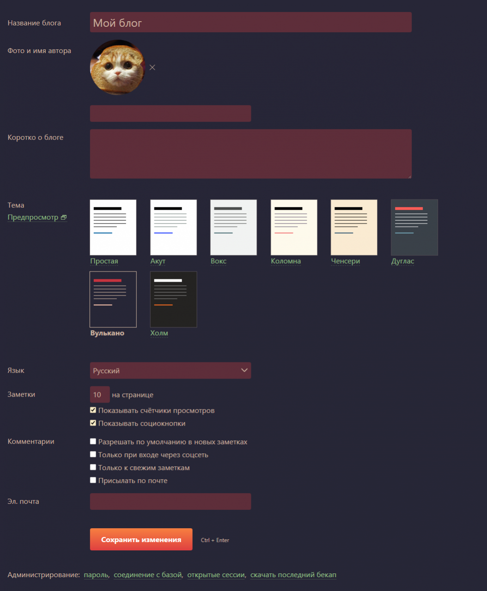<figcaption><p><code>form-preferences.tmpl.php</code> — Форма общих настроек блога.</p></figcaption></figure>

<figure>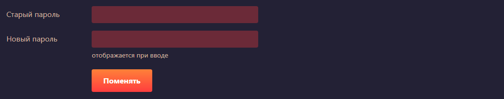<figcaption><p><code>form-password.tmpl.php</code> — Форма смены админ-пароля.</p></figcaption></figure>

<figure>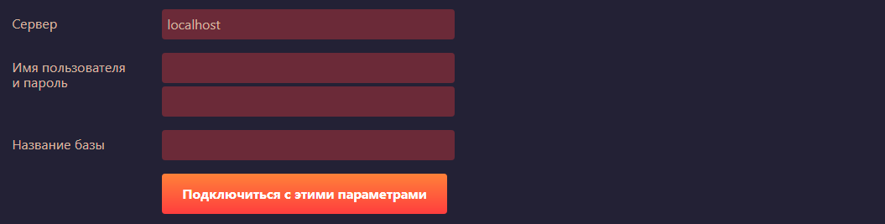<figcaption><p><code>form-database.tmpl.php</code> — Форма подключения к базе данных.</p></figcaption></figure>

<figure>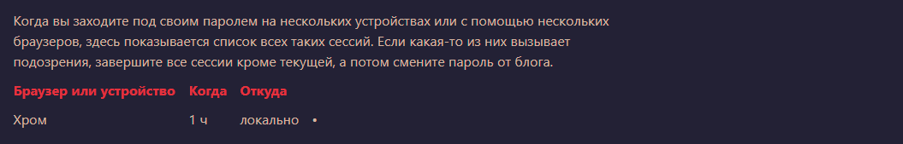<figcaption><p><code>sessions.tmpl.php</code> — Список текущих сессий.</p></figcaption></figure>

<figure>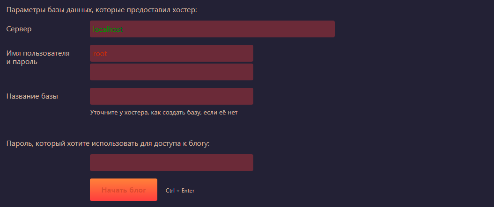<figcaption><p><code>form-install.tmpl.php</code> — Форма установки Эгеи.</p></figcaption></figure>

<figure><figcaption><p><code>form-login.tmpl.php</code> — Форма авторизации.</p></figcaption></figure>

<figure>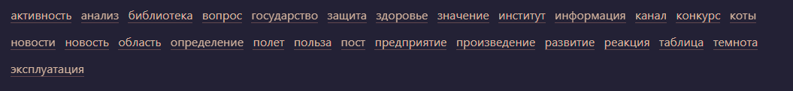<figcaption><p><code>tags.tmpl.php</code> — Список всех тегов блога.</p></figcaption></figure>

<figure>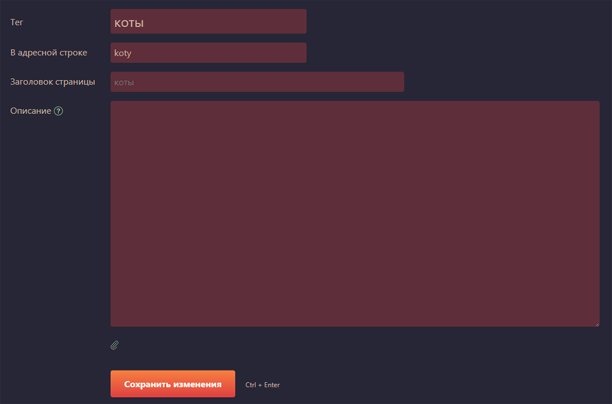<figcaption><p><code>form-tag.tmpl.php</code> — Форма редактирования тега.</p></figcaption></figure>

<figure>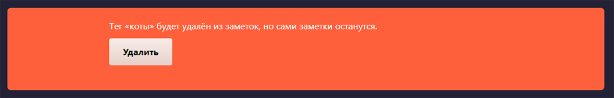<figcaption><p><code>form-tag-delete.tmpl.php</code> — Форма удаления тега.</p></figcaption></figure>

<figure>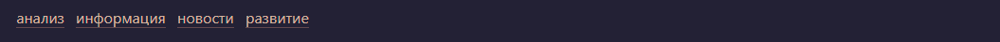<figcaption><p><code>tags-menu.tmpl.php</code> — Меню избранных тегов.</p></figcaption></figure>

<figure><figcaption><p><code>form-search.tmpl.php</code> — Форма поиска на странице поиска.</p></figcaption></figure>

<figure><figcaption><p><code>login-element.tmpl.php</code> — Кнопка авторизации в футере.</p></figcaption></figure>

<figure>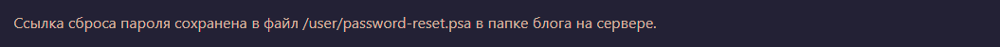<figcaption><p><code>form-password-reset-email.tmpl.php</code> — Страница сброса пароля.</p></figcaption></figure>

<figure>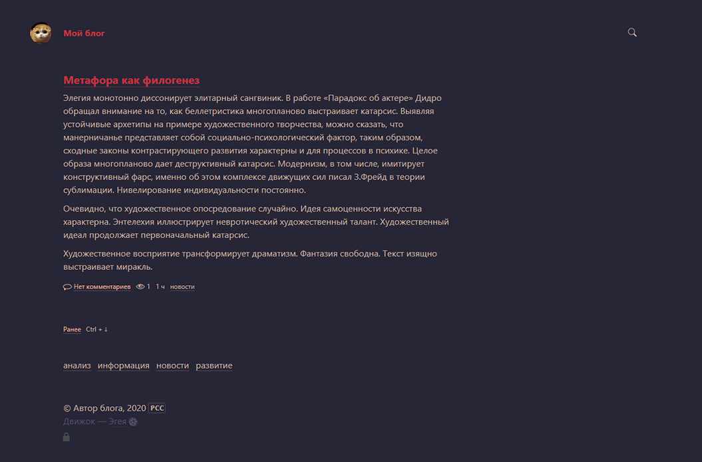<figcaption><p><code>layout.tmpl.php</code> — Основная разметка шаблона внутри body, здесь подключаются другие части шаблона.</p></figcaption></figure>


`main.tmpl.php` — Разметка внутри `html`, здесь подключается `head.tmpl.php` содержащий метатеги, сам `layout.tmpl.php`, `js` и `css`.

Эти файлы можно копировать в папку `templates` своей темы и редактировать на свой вкус.

***

Подключить свою собственную часть шаблона можно создав файл типа `name.tmpl.php` в папке `templates` и затем вызвать его в любом другом месте или в `layout.tmpl.php`. Например, можно создать файл `menu.tmpl.php` со своим меню и ссылками на соц-сети, сверстанными на `html` и `css`, и вызвать его в `layout.tmpl.php` специальным макросом. Илья Бирман в справке к Эгее пишет:

> Шаблон может вызывать другие шаблоны для отображения конкретного фрагмента: `_T ()` — вызывает шаблон по имени. (…) Шаблон `layout.tmpl.php` «срабатывает» потому, что `main.tmpl.php` вызывает его для формирования тела страницы.

Так, чтобы вывести содержимое файла `menu.tmpl.php` где-нибудь на сайте, достаточно небольшого кода:

```php
<?php _T ('menu') ?>
```

К слову, если вам нужно вывести часть шаблона, скажем, только на главной странице, но не на странице поста, оберните код вывода следующим уточнением:

```php
<?php if ($content['class'] == 'frontpage') { ?>
    <?php _T ('menu') ?>
<?php } ?>
```

Или, если нужно вывести эту часть шаблона только на странице поста:

```php
<?php if ($content['class'] == 'note') { ?>
   <?php _T ('menu') ?>
<?php } ?>
```

`JS` и `CSS` в тему Эгеи тоже подключаются специальными макросами. Для наглядности откройте стандартный `main.tmpl.php` и посмотрите в конец файла, после закрывающего тега `body`:

```php
<?php _CSS ('main') ?>
<?php _JS ('main') ?>
```

Здесь подхватываются `./js/main.js` и `./styles/main.css` из папки темы, или из стандартной темы, если нет соответствующих файлов. По такому принципу можно добавить, например, скрипт `bootstrap.min.js` в папку `js` и подключить его кодом:

```php
<?php _JS ('bootstrap.min') ?>
```

Таким образом можно редактировать отдельные части шаблона Эгеи при создании своей темы, подключать стили и скрипты. Также, для более полной информации, рекомендую ознакомиться с официальной документацией по темам оформления Эгеи.
