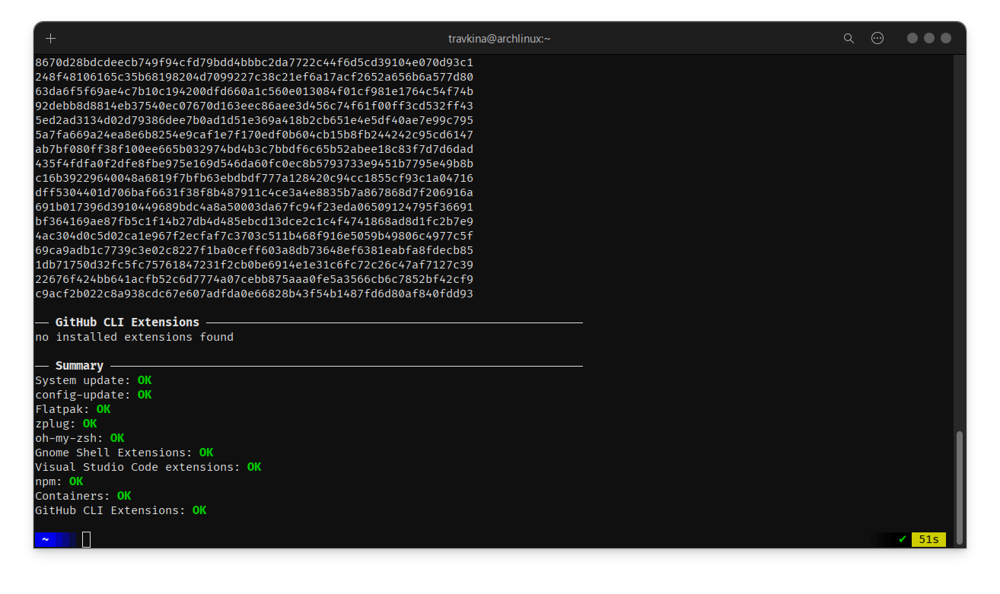

# topgrade

Установка topgrade

```bash
yay -S topgrade
```


Обновить всё


```bash
topgrade
```


<figure><figcaption></figcaption></figure>


Файл конфигурации можно отредактировать


```bash
nano ~/.config/topgrade.toml
```


***


```toml
# Include any additional configuration file(s)

[misc]
# Sudo command to be used
sudo_command = "sudo"

# Do not set the terminal title (default: true)
# set_title = true

# Display the time in step titles
display_time = false

# Cleanup temporary or old files
cleanup = true

[linux]
arch_package_manager = "pacman"
yay_arguments = "--nodevel"

[npm]
# Use sudo if the NPM directory isn't owned by the current user
use_sudo = true

[firmware]
# Offer to update firmware; if false just check for and display available updates
upgrade = false

[flatpak]
# Use sudo for updating the system-wide installation
# use_sudo = true

[distrobox]
use_root = false
```

