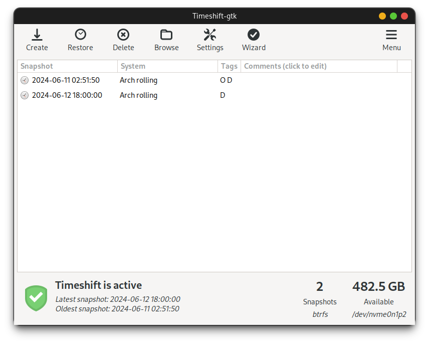

# Бэкапы

<figure><figcaption></figcaption></figure>



Установите `timeshift` и `cronie`:


```bash
aura -S timeshift cronie
```




Запустите сервис:


```bash
sudo systemctl enable --now cronie
```





Настроить автоматическое создание снимков можно через GUI:


```bash
sudo timeshift-gtk
```



#### GRUB

Для добавления пункта меню с выбором снимков в `grub` -



Установите `grub-btrfs`:


```bash
aura -S grub-btrfs
```




Запустите сервис:


```bash
sudo systemctl enable --now grub-btrfsd
```




Обновите конфигурацию `grub`:


```bash
sudo grub-mkconfig -o /boot/grub/grub.cfg
```



