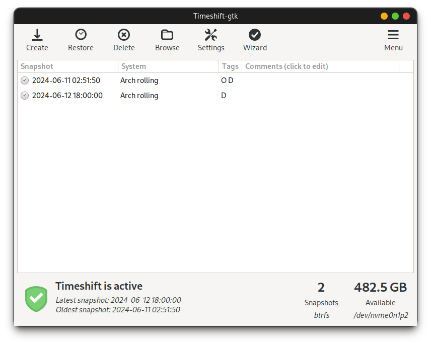

# Бэкапы

<figure><figcaption></figcaption></figure>

Установите `timeshift` и `cronie`:


```bash
yay -S timeshift cronie
```


Запустите сервис:


```bash
sudo systemctl enable --now cronie
```


***

Настроить автоматическое создание снимков можно через GUI:


```bash
sudo timeshift-gtk
```



### GRUB

Для добавления пункта меню с выбором снимков в `grub` установите `grub-btrfs`:


```bash
sudo pacman -S grub-btrfs
```


Запустите сервис:


```bash
sudo systemctl enable --now grub-btrfsd
```


Обновите конфигурацию `grub`:


```bash
sudo grub-mkconfig -o /boot/grub/grub.cfg
```

