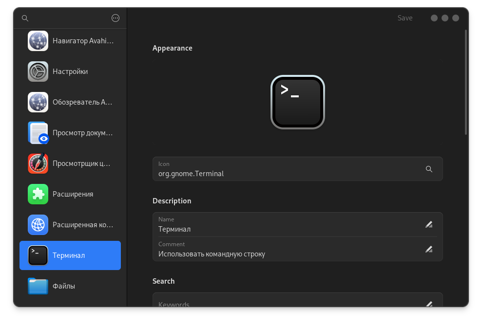
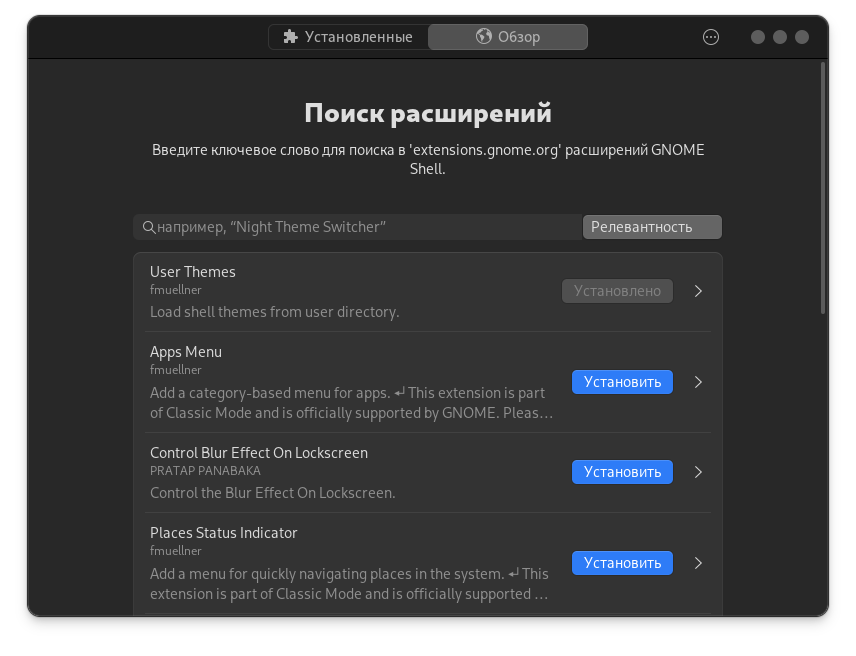

# GNOME

### Удаление предустановленных пакетов

Обычно я пользуюсь оболочкой GNOME и после установки ОС удаляю ненужные, предустановленные пакеты.


```bash
aura -Rsu baobab
```



```bash
aura -Rsu epiphany
```



```bash
aura -Rsu totem
```



```bash
aura -Rsu snapshot
```



```bash
aura -Rsu gnome-maps
```



```bash
aura -Rsu gnome-calendar
```



```bash
aura -Rsu gnome-contacts
```



```bash
aura -Rsu gnome-music
```



```bash
aura -Rsu gnome-weather
```



```bash
aura -Rsu gnome-connections
```



```bash
aura -Rsu gnome-shell-extensions
```



```bash
aura -Rsu malcontent
```



```bash
aura -Rsu gnome-system-monitor
```



```bash
aura -Rsu simple-scan
```



```bash
aura -Rsu yelp
```



```bash
aura -Rsu gnome-text-editor
```



```bash
aura -Rsu gnome-tour
```



```bash
aura -Rsu gnome-software
```



```bash
aura -Rsu gnome-clocks
```


#### Удалить всё одной командой:


```bash
aura -Rsu baobab epiphany totem snapshot gnome-maps gnome-contacts gnome-music gnome-weather gnome-connections simple-scan yelp gnome-text-editor gnome-tour gnome-software gnome-clocks gnome-calendar gnome-characters gnome-system-monitor gnome-font-viewer gnome-logs gnome-remote-desktop gnome-backgrounds gnome-user-docs gnome-user-share gnome-menus gnome-tweaks malcontent evince sushi loupe orca rygel gvfs-afc gvfs-dnssd gvfs-goa gvfs-gphoto2 gvfs-mtp gvfs-nfs gvfs-smb gvfs-wsdd gvfs-google gvfs-onedrive htop vim nm-connection-editor network-manager-applet
```



`flatpak` будет удалён как зависимость при удалении пакета родительского контроля `malcontent`, если нужен верните: `aura -S flatpak`. Также из предустановленных пакетов я удаляю `htop` и `vim`.



### Отключение лишних служб


```bash
systemctl --user mask org.gnome.SettingsDaemon.Wacom.service
```



```bash
systemctl --user mask org.gnome.SettingsDaemon.PrintNotifications.service
```



```bash
systemctl --user mask org.gnome.SettingsDaemon.A11ySettings.service
```



```bash
systemctl --user mask org.gnome.SettingsDaemon.ScreensaverProxy.service
```



```bash
systemctl --user mask org.gnome.SettingsDaemon.Sharing.service
```



```bash
systemctl --user mask org.gnome.SettingsDaemon.Smartcard.service
```



### Удаление лишних ярлыков


```bash
sudo rm /usr/share/applications/avahi-discover.desktop && sudo rm /usr/share/applications/bssh.desktop && sudo rm /usr/share/applications/bvnc.desktop && sudo rm /usr/share/applications/qv4l2.desktop && sudo rm /usr/share/applications/qvidcap.desktop && sudo rm /usr/share/applications/org.gnome.OnlineAccounts.OAuth2.desktop && sudo rm /usr/share/applications/nautilus-autorun-software.desktop && sudo rm /usr/share/applications/gcm-import.desktop && sudo rm /usr/share/applications/org.gnome.Extensions.desktop
```



### Терминал вместо консоли


```bash
aura -S gnome-terminal && aura -Rsu gnome-console
```



### Редактор меню

<figure><figcaption></figcaption></figure>




```bash
flatpak install page.codeberg.libre_menu_editor.LibreMenuEditor
```





```bash
aura -A libre-menu-editor
```





### Менеджер расширений GNOME

<figure><figcaption></figcaption></figure>




```bash
flatpak install com.mattjakeman.ExtensionManager
```





```bash
aura -A extension-manager
```





### Раскладка клавиатуры

Смена раскладки клавиатуры на `shift` + `alt`


```bash
gsettings set org.gnome.desktop.wm.keybindings switch-input-source-backward "['<Shift>Alt_L']" && gsettings set org.gnome.desktop.wm.keybindings switch-input-source "['<Alt>Shift_L']"
```

