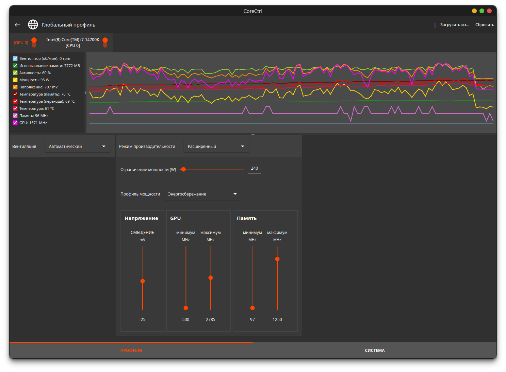

# AMD


```bash
aura -S --needed libva-mesa-driver lib32-libva-mesa-driver mesa-vdpau lib32-mesa-vdpau libva-vdpau-driver lib32-libva-vdpau-driver vulkan-radeon lib32-vulkan-radeon
```



Некоторые системы требуют раннего запуска KMS (Kernel Mode Setting) для корректной работы.




```bash
sudo nano /etc/mkinitcpio.conf
```




Добавьте `amdgpu` к `MODULES=()`:


```ini
MODULES=(amdgpu)
```




И выполните:


```bash
sudo mkinitcpio -P
```





### CoreCtrl

<figure><figcaption></figcaption></figure>


```bash
aura -S corectrl
```

