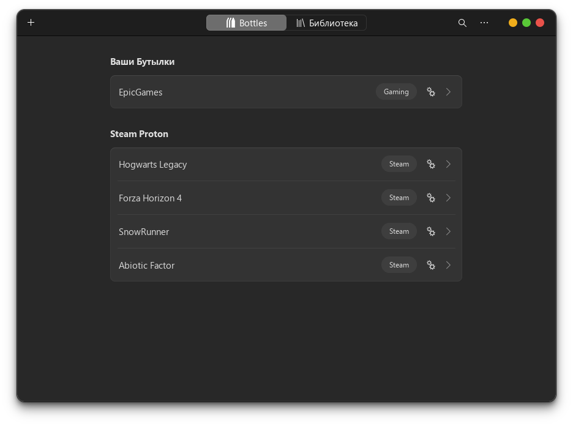

# Игры

### Базовые библиотеки


```bash
aura -A wine-staging giflib lib32-giflib libpng lib32-libpng libldap lib32-libldap gnutls lib32-gnutls mpg123 lib32-mpg123 openal lib32-openal v4l-utils lib32-v4l-utils libpulse lib32-libpulse libgpg-error lib32-libgpg-error alsa-plugins lib32-alsa-plugins alsa-lib lib32-alsa-lib libjpeg-turbo lib32-libjpeg-turbo sqlite lib32-sqlite libxcomposite lib32-libxcomposite libxinerama lib32-libgcrypt libgcrypt lib32-libxinerama ncurses lib32-ncurses ocl-icd lib32-ocl-icd libxslt lib32-libxslt libva lib32-libva gtk3 lib32-gtk3 gst-plugins-base-libs lib32-gst-plugins-base-libs vulkan-icd-loader lib32-vulkan-icd-loader vkd3d lib32-vkd3d
```



### steam




```bash
flatpak install com.valvesoftware.Steam
```





```bash
aura -S steam
```





### mangohud




```bash
flatpak install org.freedesktop.Platform.VulkanLayer.MangoHud
```


Конфигурация:


```bash
mkdir ~/.var/app/com.valvesoftware.Steam/config/MangoHud && nano ~/.var/app/com.valvesoftware.Steam/config/MangoHud/MangoHud.conf
```



```ini
horizontal
legacy_layout=0
table_columns=20
fps
gpu_stats
gpu_temp
vram
cpu_stats
cpu_temp
ram
frametime=0
frame_timing=1
hud_no_margin
```


Разрешите доступ `mangohud` для `steam`:


```bash
flatpak override --user --filesystem=xdg-config/MangoHud:ro com.valvesoftware.Steam
```


Включите `mangohud` во всех играх, если нужно:


```bash
flatpak override --user --env=MANGOHUD=1 com.valvesoftware.Steam
```





```bash
aura -S mangohud lib32-mangohud
```


Конфигурация:


```bash
mkdir ~/.config/MangoHud && nano ~/.config/MangoHud/MangoHud.conf
```



```ini
horizontal
legacy_layout=0
table_columns=20
fps
gpu_stats
gpu_temp
vram
cpu_stats
cpu_temp
ram
frametime=0
frame_timing=1
hud_no_margin
```




Теперь можно включить `mangohud` в параметрах запуска игры в `steam`:


```bash
 mangohud %command%
```


Для использования с режимом `gamescope`:


```bash
gamescope --mangoapp -- %command%
```



### gamescope




```bash
flatpak install org.freedesktop.Platform.VulkanLayer.gamescope
```





```bash
aura -S gamescope
```





### gamemode


```bash
aura -S gamemode lib32-gamemode
```


Отредактируйте параметры запуска игры в `steam`, для включения `gamemode` режима:


```ini
gamemoderun %command%
```



### bottles

<figure><figcaption></figcaption></figure>




```bash
flatpak install com.usebottles.bottles
```





```bash
aura -A bottles
```





### lutris




```bash
flatpak install net.lutris.Lutris
```





```bash
aura -S lutris
```



