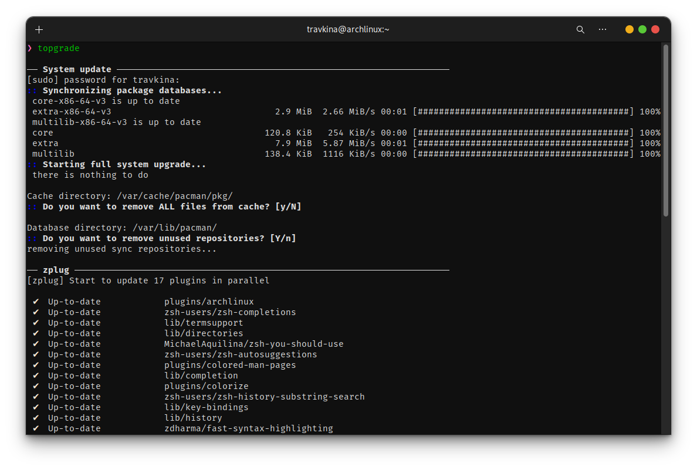
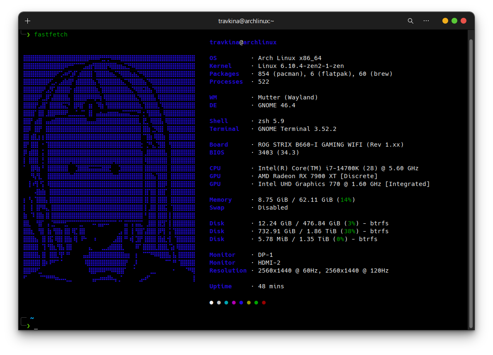

# Расширения

### topgrade

[Утилита](https://github.com/topgrade-rs/topgrade) для обновления различных частей системы и приложений. Она автоматически определяет используемые пакетные менеджеры, языковые среды и инструменты конфигурации, затем обновляет все соответствующие компоненты.


```bash
aura -A topgrade
```



```bash
topgrade
```


<figure><figcaption></figcaption></figure>


Пример конфигурации:




```bash
nano ~/.config/topgrade.toml
```





```toml
# Include any additional configuration file(s)

[misc]
# Sudo command to be used
sudo_command = "sudo"

# Do not set the terminal title (default: true)
# set_title = true

# Display the time in step titles
display_time = false

# Cleanup temporary or old files
cleanup = true

[linux]
arch_package_manager = "pacman"
yay_arguments = "--nodevel"

[npm]
# Use sudo if the NPM directory isn't owned by the current user
use_sudo = true

[firmware]
# Offer to update firmware; if false just check for and display available updates
upgrade = false

[flatpak]
# Use sudo for updating the system-wide installation
# use_sudo = true

[distrobox]
use_root = false
```





### fastfetch

[Утилита](https://github.com/fastfetch-cli/fastfetch) для вывода информации о системе в терминале. Напоминает `neofetch`, предоставляя подробные сведения о системе, такие как дистрибутив операционной системы, ядро, аппаратные характеристики, информация о CPU и GPU, память, разделы дисков и текущую тему рабочего стола.


```bash
aura -S fastfetch
```


<figure><figcaption></figcaption></figure>


Можно создать пользовательский файл конфигурации:



```bash
mkdir ~/.config/fastfetch/ && nano ~/.config/fastfetch/config.jsonc
```




```json
{
  "$schema": "https://github.com/fastfetch-cli/fastfetch/raw/dev/doc/json_schema.json",
  "logo": {
    "source": "~/.config/fastfetch/logo.txt",
    "color": {
      "1": "blue"
    },
    "padding": {
      "top": 2,
      "left": 1
    }
  },
  "display": {
    "separator": "· ",
    "color": "blue"
  },
  "modules": [{
      "type": "title",
      "keyColor": "blue",
      "format": "{6}{7}{8}"
    },
    "break",
    {
      "key": "OS         ",
      "keyColor": "blue",
      "type": "os"
    },
    {
      "key": "Kernel     ",
      "keyColor": "blue",
      "type": "kernel",
      "format": "{1} {2}"
    },
    {
      "key": "Packages   ",
      "keyColor": "blue",
      "type": "packages"
    },
    {
      "key": "Processes  ",
      "keyColor": "blue",
      "type": "processes"
    },
    "break",
    {
      "key": "WM         ",
      "keyColor": "blue",
      "type": "wm"
    },
    {
      "key": "DE         ",
      "keyColor": "blue",
      "type": "de"
    },
    "break",
    {
      "key": "Shell      ",
      "keyColor": "blue",
      "type": "shell"
    },
    {
      "key": "Terminal   ",
      "keyColor": "blue",
      "type": "terminal"
    },
    "break",
    {
      "key": "Board      ",
      "keyColor": "blue",
      "type": "board"
    },
    {
      "key": "BIOS       ",
      "keyColor": "blue",
      "type": "bios"
    },
    "break",
    {
      "key": "CPU        ",
      "keyColor": "blue",
      "type": "cpu"
    },
    {
      "key": "GPU        ",
      "keyColor": "blue",
      "type": "gpu",
      "format": "{1} {2} ({3})"
    },
    "break",
    {
      "key": "Memory     ",
      "keyColor": "blue",
      "type": "memory"
    },
    {
      "key": "Swap       ",
      "keyColor": "blue",
      "type": "swap"
    },
    "break",
    {
      "key": "Disk       ",
      "keyColor": "blue",
      "type": "disk"
    },
    "break",
    {
      "key": "Monitor    ",
      "keyColor": "blue",
      "type": "monitor",
      "format": "{1}"
    },
    {
      "key": "Resolution ",
      "keyColor": "blue",
      "type": "display",
      "compactType": "original-with-refresh-rate"
    },
    "break",
    {
      "key": "Uptime     ",
      "keyColor": "blue",
      "type": "uptime"
    },
    "break",
    {
      "type": "colors",
      "symbol": "circle"
    }
  ]
}


```





```bash
nano ~/.config/fastfetch/logo.txt
```





```asciidoc
⣿⣿⣿⣿⣿⣿⣿⣿⣿⣿⣿⣿⣿⣿⣿⣿⣿⡿⠿⠿⠟⣛⢛⠻⠿⠿⣿⣿⣿⣿⣿⣿⣿⣿⣿⣿⣿⣿⣿⣿⣿⣿⣿⣿⣿⣿
⣿⣿⣿⣿⣿⣿⣿⣿⣿⣿⣿⠿⠛⠋⠉⠉⣡⣴⡞⣿⣿⣿⡟⢿⣿⣶⣦⣍⡛⠿⣿⣿⣿⣿⣿⣿⣿⣿⣿⣿⣿⣿⣿⣿⣿⣿
⣿⣿⣿⣿⣿⣿⣿⣿⡿⠋⡡⠶⢋⡾⢁⣾⣿⣿⡇⢹⣿⣿⣿⣶⣌⠙⢿⣿⣷⣴⣌⠛⢿⣿⣿⣿⣿⣿⣿⣿⣿⣿⣿⣿⣿⣿
⣿⣿⣿⣿⣿⣿⡿⢋⡠⢀⣴⣷⣿⠃⣾⣿⣿⣿⣷⡌⢿⣿⣿⣿⣿⣿⣦⡉⠻⣿⣿⣿⣦⠙⢿⣿⣿⣿⣿⣿⣿⣿⣿⣿⣿⣿
⣿⣿⣿⣿⣿⠟⣠⡻⢡⣿⣿⣿⡗⢰⣿⣿⣿⣿⣿⣷⡈⣿⣿⣿⣿⣿⣿⣿⣦⡙⢿⣿⣽⣷⡌⢻⣿⣿⣿⣿⣿⣿⣿⣿⣿⣿
⣿⣿⣿⣿⠟⣀⡿⢡⣿⣿⣿⣿⡄⢸⣿⣿⣿⠿⠿⡿⢷⠸⣿⣿⣿⣿⣿⣿⣿⣿⣌⢻⣿⣿⣿⡄⢿⣿⣿⣿⣿⣿⣿⣿⣿⣿
⣿⣿⣿⡟⣠⣿⠁⣿⣿⣿⣯⣍⠃⢸⡿⣿⠁⢰⡆⠈⢿⡆⢻⣿⣿⣿⣿⣿⣿⣿⣿⣆⢹⣿⣿⣿⡈⢿⣿⣿⣿⣿⣿⣿⣿⣿
⣿⣿⣿⠁⣿⡇⣸⣿⡿⠿⠿⠟⣀⣀⣁⣈⡁⢸⡇⢠⣴⣤⣴⣶⣶⣦⣬⣭⣍⣉⣙⠃⡂⢻⣿⣿⣧⠸⣿⣿⣿⣿⣿⣿⣿⣿
⣿⣿⠃⣴⣿⠀⣤⣴⣾⣿⣿⣿⣿⣿⣿⣿⣿⣤⣤⣼⣿⣿⣿⣿⣿⣿⣿⣿⣿⣿⣿⡀⣟⡀⢿⣿⣿⡄⢿⣿⣿⣿⣿⣿⣿⣿
⣿⡿⠀⣿⡟⠀⣿⣿⣿⣿⣿⣿⣿⣿⣿⣿⣿⣿⣿⣿⣿⣿⣿⣿⣿⣿⣿⣿⣿⣿⣿⡇⣿⣷⢈⡻⣿⡇⠸⣿⣿⣿⣿⣿⣿⣿
⣿⡇⣾⣇⡆⡆⣿⣿⣿⣿⣿⣿⣿⣿⣿⣿⣿⣿⣿⣿⣿⣿⣿⣿⣿⣿⣿⣿⣿⣿⣿⡇⠉⣿⡆⢿⣿⣷⠀⣿⣿⣿⣿⣿⣿⣿
⣿⠃⣿⣿⠀⠂⢹⣿⣿⣿⣿⣿⣿⣿⣿⣿⣿⣿⣿⣿⣿⣿⣿⣿⣿⣿⣿⣿⣿⣿⣿⣗⠀⡙⢣⡈⣻⣿⠀⢻⣿⣿⣿⣿⣿⣿
⡿⢰⣿⣿⠀⡅⢸⣿⣿⣿⣿⣿⣿⣿⣿⣿⣿⣿⣿⣿⣿⣿⣿⣿⣿⣿⣿⣿⣿⣿⣿⣷⢀⣿⣿⣿⣿⣿⡄⢸⣿⣿⣿⣿⣿⣿
⡇⢸⣿⣿⠀⡃⢸⣿⣿⣿⣿⣿⡿⣿⣿⣿⣿⣿⣿⣿⣿⣿⣿⣿⢿⣿⣿⣿⣿⣿⣿⣿⠸⣿⣿⣿⣿⣿⡇⢸⣿⣿⣿⣿⣿⣿
⠁⠀⣿⢿⡆⠃⢸⣿⣿⣿⣿⣿⠀⠀⣹⣿⣿⣯⣭⣭⣭⣿⣿⡃⠀⢈⣿⣿⣿⣿⣿⣿⢸⣿⣿⣿⣿⣿⡇⢸⣿⣿⣿⣿⣿⣿
⠀⠀⠻⡜⣇⠀⢸⣿⣿⣿⣿⣿⣷⣾⣿⣿⣿⣿⣿⣿⣿⣿⣿⣿⣶⣾⣿⣿⣿⣿⣿⣿⢸⣿⣷⡌⣿⣿⡇⢸⣿⣿⣿⣿⣿⣿
⠀⢸⠰⢻⠘⡅⠸⣿⣿⣿⣿⣿⣿⣿⣿⣿⣿⣿⣿⣿⣿⣿⣿⣿⣿⣿⣿⣿⣿⣿⣿⣿⢸⣿⣿⡇⣿⣿⠇⢸⣿⣿⣿⣿⣿⣿
⠀⠀⠀⢼⣷⣷⠀⣿⣿⣿⣿⣿⣿⣿⣿⣿⣿⣿⣿⣿⣿⣿⣿⣿⣿⣿⣿⣿⣿⣿⣿⣿⢸⡏⣿⡇⣿⣿⠁⢸⣿⣿⣿⣿⣿⣿
⡆⠘⡄⢹⣿⣿⡄⣿⣿⣿⣿⣿⣿⣿⣿⣿⣿⣿⣿⣿⣿⣿⣿⣿⣿⣿⣿⣿⣿⣿⣿⣿⢸⡇⣿⡇⣿⣿⡇⢸⣿⣿⣿⣿⣿⣿
⡇⠀⡇⢸⡟⠿⣄⢸⣿⣿⣿⣿⣿⣿⣿⣿⣿⣿⣿⣿⣿⣿⣿⣿⣿⣿⣿⣿⣿⣿⣿⣿⢸⢀⣿⡇⣿⣿⡅⠈⣿⣿⣿⣿⣿⣿
⣷⠀⠹⢸⣿⡆⣿⢸⣿⣿⣿⣿⣿⣿⣿⣿⣿⣿⣿⣿⣿⣿⣿⣿⣿⣿⣿⣿⣿⣿⣿⣿⠘⢸⣿⡇⣿⣿⡇⡇⣿⣿⣿⣿⣿⣿
⣿⣇⠀⠘⣿⠁⢠⢈⡛⠛⠛⣋⠉⠉⠉⣉⠉⠉⠩⠍⣭⡭⠭⠉⠉⠈⠁⣭⠉⡍⣭⣍⠀⣸⣿⡇⣿⣻⠁⡇⣿⣿⣿⣿⣿⣿
⣿⣿⣆⠀⢻⡇⢸⡆⢻⣿⡆⣿⡇⢿⡁⣿⡇⠀⠀⠀⠀⠀⠀⠀⠀⢀⡄⣿⠀⡇⢻⣿⢡⣿⣿⡇⡿⢻⠀⡅⢹⣿⣿⣿⣿⣿
⣿⣿⣿⣦⠀⣿⢸⣯⠸⣿⡇⣿⣷⠸⡇⠸⠓⠀⠀⠆⠀⠀⠀⠀⣠⣿⡇⠛⠰⡇⣹⡟⢸⣿⣿⡇⣿⣾⡐⡇⠈⣿⣿⣿⣿⣿
⣿⣿⣿⣿⠀⢹⠘⣿⣆⢻⣧⢸⣿⠀⠀⠀⠀⢠⡀⠀⠀⣀⣠⣾⣿⣿⣇⠀⠀⠀⠿⠁⣿⣿⣿⣇⣿⣿⣇⢩⡆⢿⣿⣿⣿⣿
⣿⣿⣿⣿⡄⣿⠀⣿⣿⡘⡟⠘⠃⠀⠀⠀⣤⣼⣿⣿⣿⣿⣿⣿⣿⣿⣿⣶⡆⠀⡆⠀⠉⠉⠛⠿⢿⣿⣿⡄⣧⢸⣿⣿⣿⣿
⣿⣿⣿⣿⡇⣿⠆⠟⠋⠁⠁⠀⠀⠀⠀⠀⠸⣿⣿⣿⣿⣿⣿⣿⣿⣿⣿⡟⠀⢀⠇⠀⠀⠀⠀⠀⠀⠀⠉⠁⠛⠈⣿⣿⣿⣿
⣿⣿⠿⠟⣁⠀⠀⠀⠀⠀⠀⠀⠀⠀⠀⠀⠀⠸⣿⡿⠿⠿⠛⠻⠿⣿⣿⠁⠀⠈⠀⠀⠀⠀⣀⡀⠀⠀⠀⠀⠂⠀⠀⠈⠛⢿
⠋⠀⠀⠀⠈⠉⠛⠛⠳⠦⠤⢄⣀⠀⠀⠀⠀⠀⢠⡤⠴⠶⠾⠷⢤⢀⠁⠀⠀⠀⠀⣠⠴⠋⠀⠀⠀⠀⠀⠀⠀⠀⠀⠀⠀⢸
```





### zsh

Командная оболочка UNIX, часто используемая в качестве замены стандартного `bash`. Известна своими расширенными функциями и улучшенной интерактивностью, например - Автодополнение команд и аргументов, алиасы, поддержка плагинов и тем, поиск по истории и т.д.


```bash
aura -S zsh
```



Пример конфигурации:




```bash
nano ~/.zshrc
```





```bash
# Ena# Enable Powerlevel10k instant prompt. Should stay close to the top of ~/.zshrc.
# Initialization code that may require console input (password prompts, [y/n]
# confirmations, etc.) must go above this block; everything else may go below.
if [[ -r "${XDG_CACHE_HOME:-$HOME/.cache}/p10k-instant-prompt-${(%):-%n}.zsh" ]]; then
  source "${XDG_CACHE_HOME:-$HOME/.cache}/p10k-instant-prompt-${(%):-%n}.zsh"
fi

export TERM="xterm-256color"
export LC_ALL=en_US.UTF-8
export EDITOR=nano

# ZPlug
if [[ ! -d ~/.zplug ]];then
  git clone https://github.com/b4b4r07/zplug ~/.zplug
fi
source ~/.zplug/init.zsh

# Theme
zplug "romkatv/powerlevel10k", as:theme, depth:1

# Aliases
zplug "robbyrussell/oh-my-zsh", as:plugin, use:"lib/*.zsh"

# Plugins
zplug "plugins/archlinux",         from:oh-my-zsh
zplug "plugins/colored-man-pages", from:oh-my-zsh
zplug "plugins/colorize",          from:oh-my-zsh
zplug "plugins/history",           from:oh-my-zsh
zplug "plugins/git",               from:oh-my-zsh
zplug "lib/completion",            from:oh-my-zsh
zplug "lib/history",               from:oh-my-zsh
zplug "lib/key-bindings",          from:oh-my-zsh
zplug "lib/termsupport",           from:oh-my-zsh
zplug "lib/directories",           from:oh-my-zsh

zplug "zsh-users/zsh-history-substring-search"
zplug "zsh-users/zsh-autosuggestions"
zplug "zsh-users/zsh-completions"
zplug "michaelAquilina/zsh-you-should-use"
zplug "zdharma/fast-syntax-highlighting"
zplug "valiev/almostontop"
zplug "lukechilds/zsh-nvm"

zplug check || zplug install
zplug load

# To customize prompt, run `p10k configure` or edit ~/.p10k.zsh.
[[ ! -f ~/.p10k.zsh ]] || source ~/.p10k.zsh

# Homebrew
# eval "$(/home/linuxbrew/.linuxbrew/bin/brew shellenv)"
```





Добавьте автозапуск `zsh` в `.bashrc`:




```bash
nano ~/.bashrc
```





```bash
if [ -z "${NOZSH}" ] && [ $TERM = "xterm" -o $TERM = "xterm-256color" -o $TERM = "screen" ] && type zsh &> /dev/null
then
  export SHELL=$(which zsh)
  if [[ -o login ]]
  then
      exec zsh -l
  else
      exec zsh
  fi
fi
```



