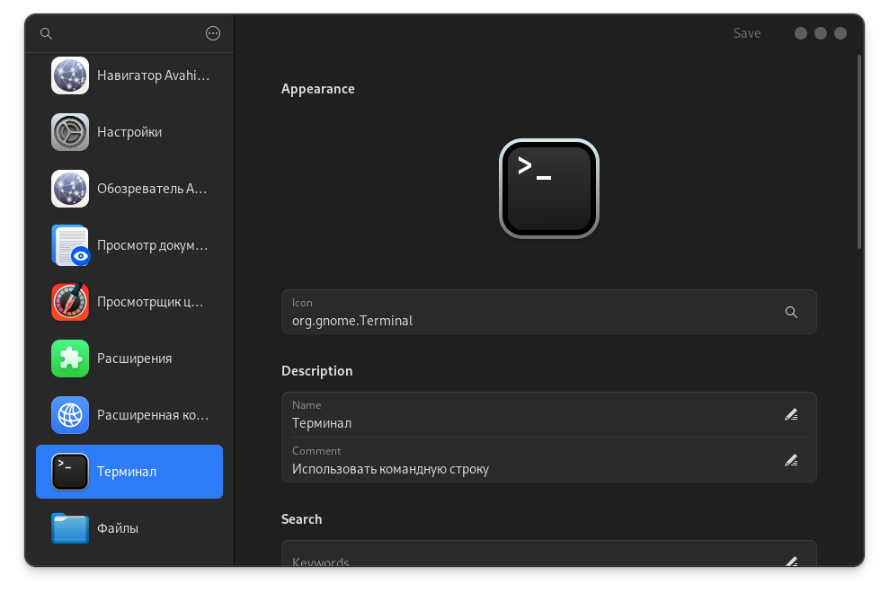
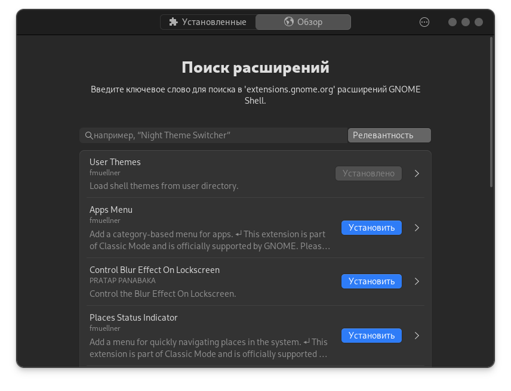

# GNOME

### Удаление предустановленных пакетов

Обычно я пользуюсь оболочкой GNOME и после установки ОС удаляю ненужные, предустановленные пакеты.


```bash
sudo pacman -Rns baobab
```



```bash
sudo pacman -Rns epiphany
```



```bash
sudo pacman -Rns totem
```



```bash
sudo pacman -Rns snapshot
```



```bash
sudo pacman -Rns gnome-maps
```



```bash
sudo pacman -Rns gnome-calendar
```



```bash
sudo pacman -Rns gnome-contacts
```



```bash
sudo pacman -Rns gnome-music
```



```bash
sudo pacman -Rns gnome-weather
```



```bash
sudo pacman -Rns gnome-connections
```



```bash
sudo pacman -Rns gnome-shell-extensions
```



```bash
sudo pacman -Rns malcontent
```



```bash
sudo pacman -Rns gnome-system-monitor
```



```bash
sudo pacman -Rns simple-scan
```



```bash
sudo pacman -Rns yelp
```



```bash
sudo pacman -Rns gnome-text-editor
```



```bash
sudo pacman -Rns gnome-tour
```



```bash
sudo pacman -Rns gnome-software
```



```bash
sudo pacman -Rns gnome-clocks
```


#### Удалить всё одной командой:


```bash
sudo pacman -Rns baobab epiphany totem snapshot gnome-maps gnome-contacts gnome-music gnome-weather gnome-connections simple-scan yelp gnome-text-editor gnome-tour gnome-software gnome-clocks gnome-calendar gnome-characters gnome-system-monitor gnome-font-viewer gnome-logs gnome-remote-desktop gnome-shell-extensions gnome-backgrounds gnome-user-docs gnome-user-share gnome-menus malcontent evince sushi loupe orca rygel tracker3-miners gvfs-afc gvfs-dnssd gvfs-goa gvfs-gphoto2 gvfs-mtp gvfs-nfs gvfs-smb gvfs-wsdd gvfs-google gvfs-onedrive htop vim nm-connection-editor network-manager-applet
```



`flatpak` будет удалён как зависимость, если нужен верните: `sudo pacman -S flatpak`

Также из предустановленных пакетов я удаляю `htop` и `vim`



### Отключение лишних служб


```bash
systemctl --user mask org.gnome.SettingsDaemon.Wacom.service
```



```bash
systemctl --user mask org.gnome.SettingsDaemon.PrintNotifications.service
```



```bash
systemctl --user mask org.gnome.SettingsDaemon.A11ySettings.service
```



```bash
systemctl --user mask org.gnome.SettingsDaemon.ScreensaverProxy.service
```



```bash
systemctl --user mask org.gnome.SettingsDaemon.Sharing.service
```



```bash
systemctl --user mask org.gnome.SettingsDaemon.Smartcard.service
```



### Терминал вместо консоли


```bash
sudo pacman -S gnome-terminal && sudo pacman -Rns gnome-console
```



### Редактор меню

<figure><figcaption></figcaption></figure>




```bash
flatpak install LibreMenuEditor
```





```bash
pikaur -S libre-menu-editor
```







### Менеджер расширений GNOME

<figure><figcaption></figcaption></figure>




```bash
flatpak install ExtensionManager
```





```bash
pikaur -S extension-manager
```







### Настройки


```bash
gsettings set org.gnome.desktop.wm.keybindings switch-input-source-backward "['<Shift>Alt_L']" && gsettings set org.gnome.desktop.wm.keybindings switch-input-source "['<Alt>Shift_L']"
```



### Патчи производительности


```bash
pikaur -S gnome-shell-performance mutter-performance
```

