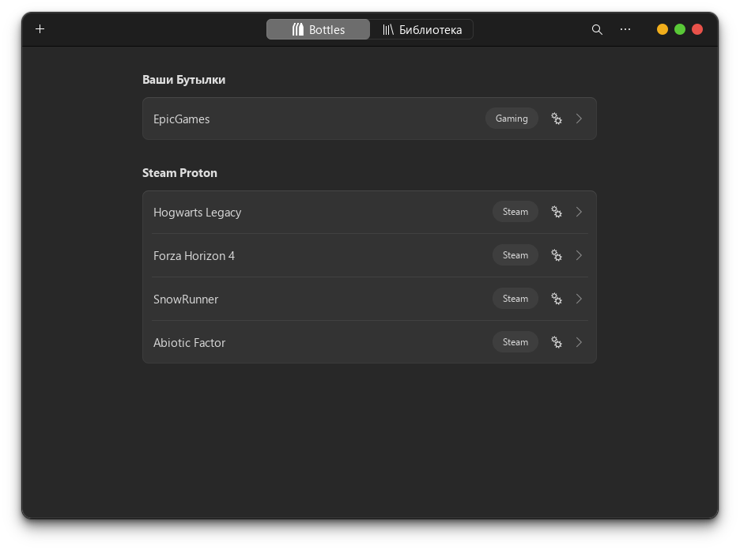

---
layout:
  title:
    visible: true
  description:
    visible: true
  tableOfContents:
    visible: true
  outline:
    visible: true
  pagination:
    visible: false
---

# 🎮 Игры

#### mangohud


```bash
flatpak install org.freedesktop.Platform.VulkanLayer.MangoHud
```


Конфигурация:




```bash
mkdir ~/.var/app/com.valvesoftware.Steam/config/MangoHud && nano ~/.var/app/com.valvesoftware.Steam/config/MangoHud/MangoHud.conf
```


Разрешите доступ к файлу конфигурации для `steam`:


```bash
flatpak override --user --filesystem=xdg-config/MangoHud:ro com.valvesoftware.Steam
```





```ini
horizontal
legacy_layout=0
table_columns=20
fps
gpu_stats
gpu_temp
vram
cpu_stats
cpu_temp
ram
frametime=0
frame_timing=1
hud_no_margin
```




Теперь можно включить `mangohud` в параметрах запуска игры в `steam`:


```bash
 mangohud %command%
```


Для использования с режимом `gamescope`:


```bash
gamescope --mangoapp -- %command%
```


Включение `mangohud` во всех играх:


```bash
flatpak override --user --env=MANGOHUD=1 com.valvesoftware.Steam
```


#### gamescope


```bash
flatpak install org.freedesktop.Platform.VulkanLayer.gamescope
```


#### gamemode

Отредактируйте параметры запуска игры в `steam`, для включения `gamemode` режима:


```ini
gamemoderun %command%
```



### steam


```bash
flatpak install com.valvesoftware.Steam
```



### bottles

<figure><figcaption></figcaption></figure>


```bash
flatpak install com.usebottles.bottles
```



### lutris


```bash
flatpak install net.lutris.Lutris
```

