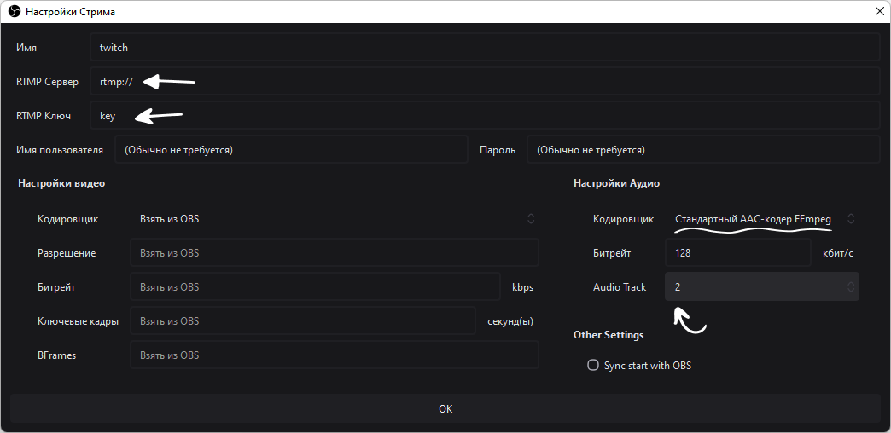
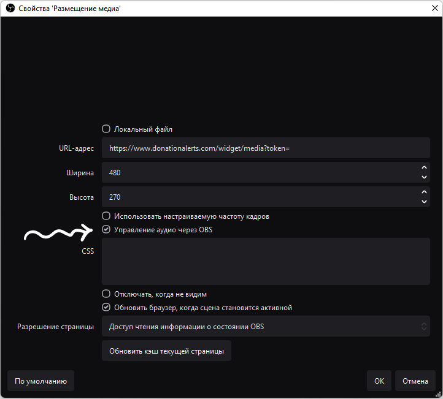
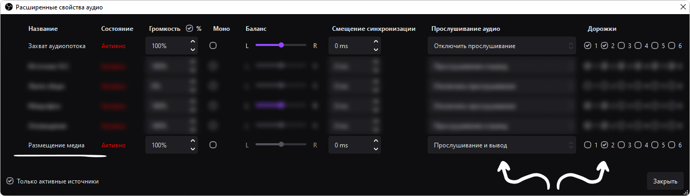
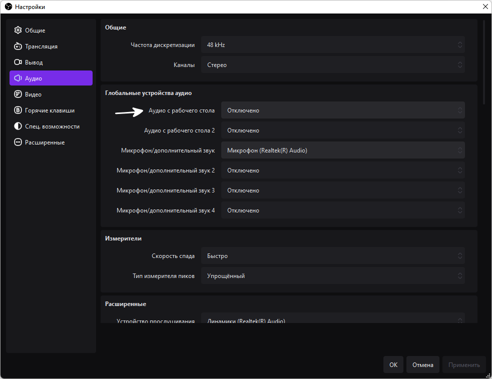
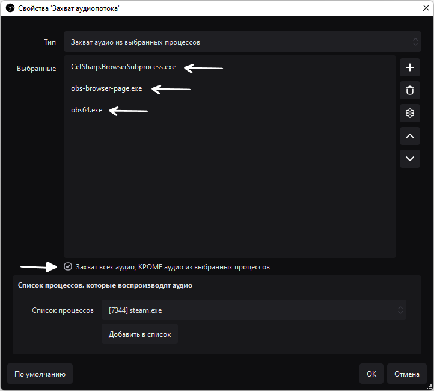
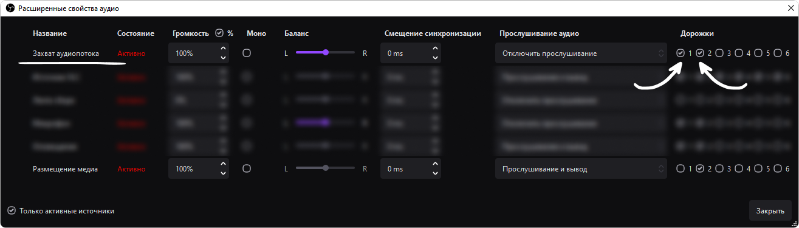

# Разные аудиодорожки на разных стримах

Бывают ситуации когда при рестриме на разные площадки, например на youtube и twitch одновременно, необходимо сделать так, чтобы музыка на одной из площадок не воспроизводилась во время стрима, а на другой наоборот - воспроизводилась.

Например нужно, чтобы заказанные через donationalerts музыкальные клипы с авторским правом не воспроизводились на youtube и их могли слышать только зрители на twitch. Либо вы хотите транслировать фоновую музыку во время игры, но не хотите получить страйк за авторские права на youtube - логично выводить музыку только на ту площадку, где вам не грозит бан.


К слову, твич самостоятельно вырезает музыку с авторскими правами из записи VOD, но можно разделить дорожки так, чтобы музыка вообще не попадала в VOD твича, на всякий случай.


Для рестрима на две площадки и вывода отдельных дорожек понадобится плагин Multiple RTMP для OBS Studio.


[restream](../restream/)


Добавьте первый источник стрима, например youtube. Укажите `RTMP Сервер` и `RTMP Ключ`. В блоке `Настройки Аудио` выберете `Стандартный AAC-кодер FFmpeg`, выберете битрейт аудио - `128`, `160` или `320`, в зависимости от предпочтений. В графе `Audio Track` укажите дорожку для youtube, пусть это будет дорожка `1`.

<figure><figcaption></figcaption></figure>

Затем добавьте вторую площадку, например twitch. Аналогично укажите `RTMP Сервер` и `RTMP Ключ` трансляции для твича. В разделе `Настройки Аудио` укажите всё тоже самое, что и в предыдущих настройках, но в графе `Audio Track` выберете аудиодорожку под номером `2`.

<figure><figcaption></figcaption></figure>

Теперь, в микшере звука OBS источники звука с дорожкой `1` будут воспроизводиться только для youtube, а источники с дорожкой `2` - только для twitch. Источники где выбрана дорожка `1` и `2` будут воспроизводиться на обеих площадках.

### Добавляем источник аудио и выбираем его дорожку 

В источниках добавьте источник браузера, можно назвать его `Размещение медиа`. Укажите ссылку вывода заказанного медиа с donationalerts. В настройках поставьте галочку `Управление аудио через OBS` - так как теперь вы будете прослушивать и выбирать аудиодорожку этого источника непосредственно через сам OBS.

<figure><figcaption></figcaption></figure>

Откройте микшер OBS и выберете для источника Размещение медиа дорожку `2` - ту дорожку которая выводится через Multiple RTMP только для стрима на twitch. В столбце `Прослушивание аудио` выберете `Прослушивание и вывод`, чтобы прослушивать заказанную музыку только через OBS, а не общий источник аудио.

<figure><figcaption></figcaption></figure>

### Исключаем звук источника браузера из основного захвата аудио 

Тем не менее, если вы добавите источник аудио и выберете `Прослушивание и вывод` через OBS оно всё равно будет воспроизводиться в вашем основном источнике аудио (Так, как будто вы прослушиваете его со своего компьютера, как звук любой игры, например). Чтобы исключить музыку с donationalerts из основного захвата аудио вам понадобится плагин Win Capture Audio.

Откройте основные настройки OBS и во вкладке Аудио отключите источник `Аудио с рабочего стола` - теперь основной источник аудио будет работать через плагин, а не через сам OBS.

<figure><figcaption></figcaption></figure>

Добавьте новый источник `Захват выходного аудиопотока процессов`, можно назвать его `Захват аудиопотока`. Откройте его `Свойства`.

Здесь нужно поставить галочку `Захват всех аудио, КРОМЕ аудио из выбранных процессов`. В выпадающем меню `Список процессов` выберете и добавьте процессы `obs64.exe`, `obs-browser-page.exe` и `CefSharp.BrowserSubpocess.exe` (Если он есть) - эти процессы отвечают за вывод звука из источников браузера добавленных в OBS.

<figure><figcaption></figcaption></figure>

Если в списке процессов нет `obs-browser-page.exe` добавьте какой ни будь источник браузера с воспроизводимым звуком и переоткройте свойства `Захвата аудиопотока`.

Будьте внимательны, после исключения этих процессов из `Захвата аудиопотока`, для каждого источника браузера с выводом аудио в OBS, в микшере нужно указывать `Прослушивание и вывод` иначе ни вы, ни зрители не услышат звук из этих источников. Например для источника оповещений RutonyChat нужно будет включить `Управление аудио через OBS` и `Прослушивание и вывод` в микшере.

Затем снова откройте `Микшер аудио` в OBS и для источника `Захват аудиопотока` выберете дорожки `1` и `2`, чтобы основные звуки приложений и игр воспроизводились на обоих стримах youtube и twitch.

<figure><figcaption></figcaption></figure>

На этом всё, вы настроили две отдельных дорожки, дорожку `1` для youtube и дорожку `2` для twitch. Заказанная с donationalerts музыка будет выводиться только на дорожке `2` - для стрима на twitch, а `Захват аудиопотока`, со всеми остальными звуками, будет выводиться для дорожек `1` и `2` - для стримов на youtube и twitch соответственно.
