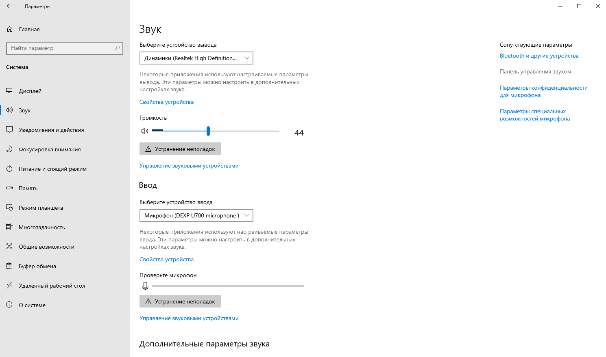
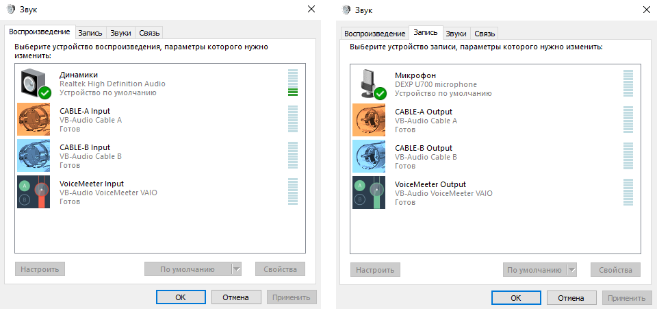
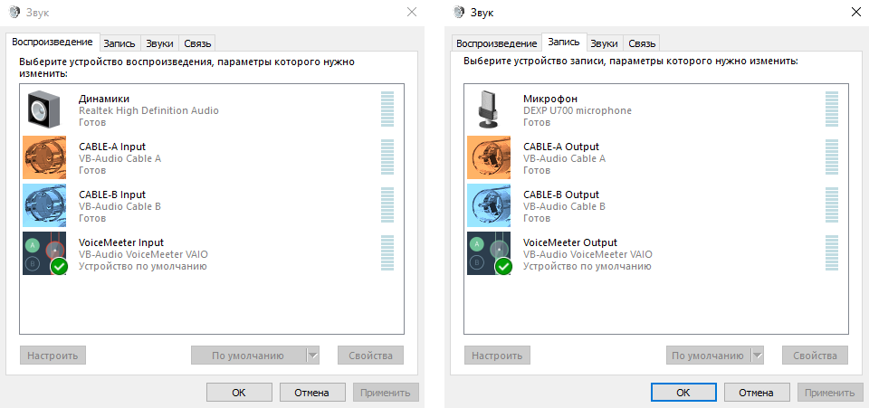
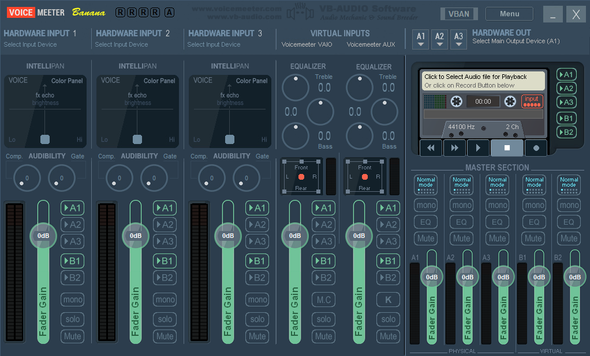
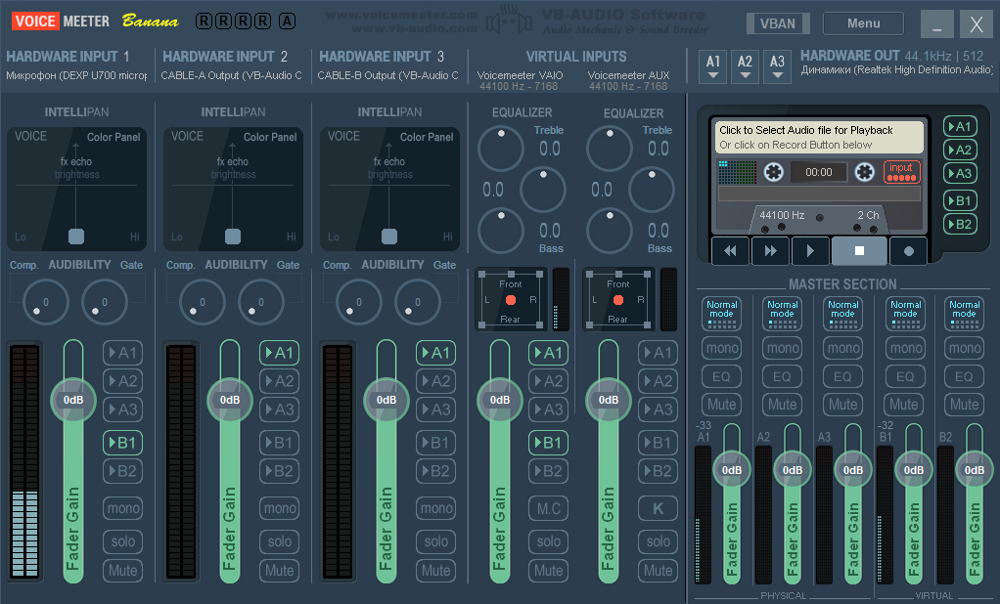
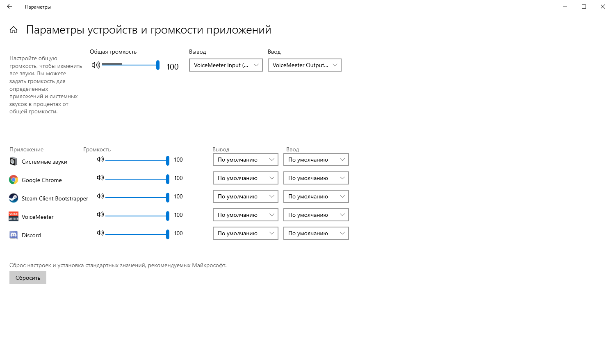
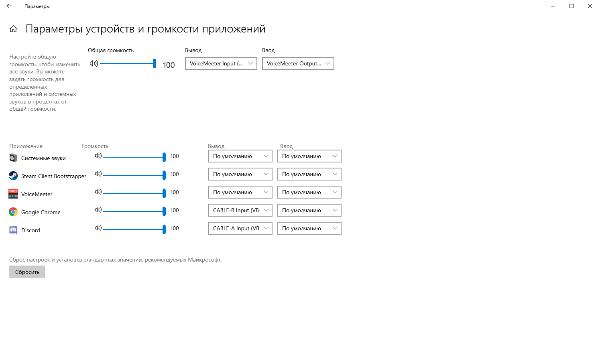
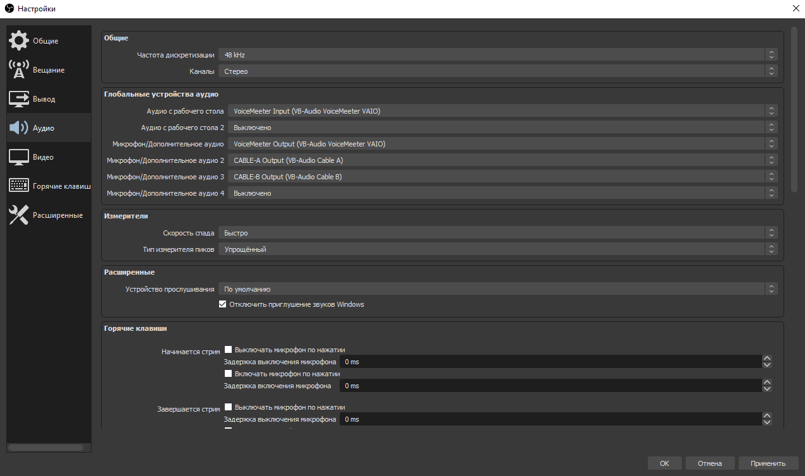
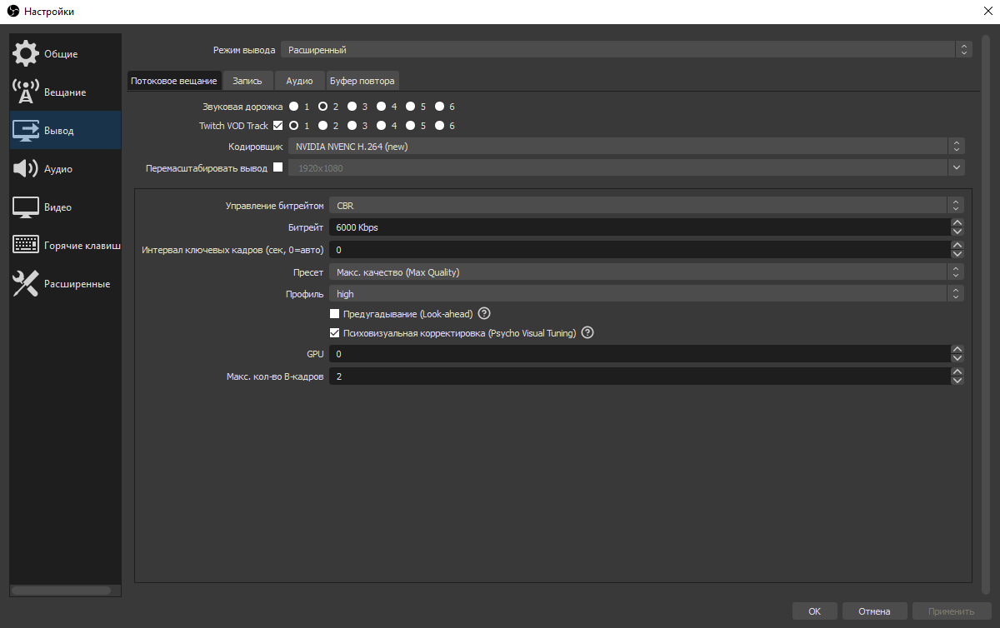
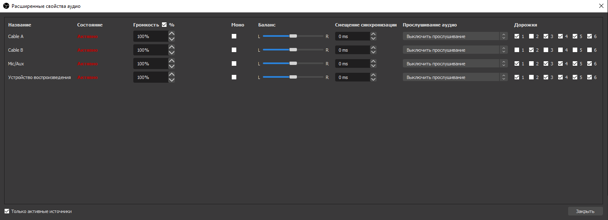

# Voicemeeter Banana

<figure><figcaption></figcaption></figure>

Для настройки понадобится пару программ - [Voicemeeter Banana](https://vb-audio.com/Voicemeeter/banana.htm) и [Virtual Audio Cable A+B](https://rutracker.org/forum/viewtopic.php?t=5716384). Устанавливаем `VBCable A` и `VBCable B` от имени администратора, затем устанавливаем сам Voicemeeter Banana и перезагружаем компьютер.



### Настройка Windows 10 

После установки программ, в своей Windows 10 откроем `Параметры` → `Система` → Вкладка `Звук` → В правой колонке `Панель управления звуком`.

<figure><figcaption></figcaption></figure>

В появившемся окне, во вкладке `Воспроизведение` отключаем `Voicemeeter Aux Input` (Правой кнопкой мыши - Отключить), во вкладке `Запись` отключаем `Voicemeeter Aux Output`, так как они нам не нужны.

В списке устройств должно получится примерно следующее, но в зависимости от ваших устройств может быть по-другому, главное чтобы устройства `VB-Audio` были такими:

<figure><figcaption></figcaption></figure>

Во вкладке `Воспроизведение` откройте свойства вашего основного источника звука, в моём случае это `Динамики`, во вкладке `Уровни` выставьте громкость на максимум, в дальнейшем регулировка громкости будет происходить через Voicemeeter Banana.

Теперь, всё в той же вкладке `Воспроизведение`, нажмите правой кнопкой мыши на `Voicemeeter Input` и выберете `Использовать по умолчанию`, а также `Использовать устройство связи по умолчанию`. Если через Voicemeeter планируете настраивать не только источник звука, но и микрофон, во вкладке `Звук` проделайте то же самое с устройством `Voicemeeter Output`.

<figure><figcaption></figcaption></figure>

После этого запускаем Voicemeeter Banana.

### Настройка Voicemeeter Banana 

<figure><figcaption></figcaption></figure>

Здесь, в самой правой колонке - `Hardware Out`, кликаем `А1` и выберем своё основное устройство источника звука, это ваши колонки или наушники, у меня это `WDM: Динамики (Realtek High Definition Audio)`. Если устройство выбрано правильно ваш воспроизводимый звук должен будет отображаться на волюметре в графе `A1` в `Master Section`, а также должен будет прослушиваться в наушниках или колонках, но уже непосредственно через Voicemeeter Banana.

Далее, в первой колонке — `Hardware Input 1` выбираем свой микрофон, если конечно будете использовать его через Voicemeeter Banana. Например `WDM: Микрофон (Dexp U700 microphone)`. Чтобы не слышать звук с микрофона, здесь же в настойках `Hardware Input 1`, отключите дорожку `А1`. Дорожку `B1` нужно оставить включенной.

В колонке `Hardware Input 2` выбираем устройство `WDM: CABLE-A Output (VB-Audio Cable A)` и оставляем ему только дорожку `А1`. В `Hardware Input 3` выбираем устройство `WDM: CABLE-B Output (VB-Audio Cable B)` и также оставляем ему дорожку `А1`.

После всех манипуляций получаются следующие настройки:

<figure><figcaption></figcaption></figure>

Теперь откроем меню по соответствующей кнопке `Menu` в правом верхнем углу Voicemeeter Banana. Здесь нужно поставить галочки на `System Tray` и на `Run on Windows Startup`, чтобы Voicemeeter автоматически запускался при включении компьютера.

В этом же меню, во вкладке `Shortcut Key (Hook)...` ставим галочку на `Hook Volume Keys (For Level Output A1)`, это нужно для того, чтобы можно было прибавлять и уменьшать громкость хоткеями на клавиатуре, как правило, это `Fn + F10` и `Fn + F11`, так как стандартными ползунками громкости в Windows управлять мы больше не можем. Если горячих клавиш для звука на клавиатуре нет, громкостью можно управлять ползунком `Fader Gain А1` в `Master Section`. Непосредственно на этом настройка Voicemeeter Banana закончена.

### Распределение по виртуальным устройствам 

Наконец пустим аудио разных программ на разные виртуальные устройства, для этого снова откроем `Параметры` в Windows → `Система` → Вкладка `Звук` → Внизу ищем `Дополнительные параметры звука`, кликаем на `Параметры устройств и громкости приложений` и наблюдаем параметры устройств для текущих открытых приложений.

<figure><figcaption></figcaption></figure>

Здесь у любой нужной программы в графе параметров `Вывод` мы можем указать новое устройство вывода звука, которое станет отдельным источником аудио в вашем OBS или любой другой программе для стриминга, если она поддерживает несколько аудио источников. При этом мы всё также будем слышать звук с этих виртуальных устройств благодаря Voicemeeter Banana.

Например, для Google Chrome можно выбрать устройство `CABLE-B Input (VB-Audio Cable B)`, а для Discord `CABLE-A Input (VB-Audio Cable A)`.

<figure><figcaption></figcaption></figure>

### Настройка OBS Studio 

После распределения нужных программ по виртуальным устройствам откроем свой любимый OBS Studio и перейдем в `Настройки` → Вкладка `Аудио`.

Здесь, в разделе `Глобальные устройства аудио`, в `Аудио с рабочего стола` укажем устройство `VoiceMeeter Input (VB-Audio VoiceMeeter VAIO)`, в `Микрофон/Дополнительное аудио` укажем устройство `VoiceMeeter Output (VB-Audio VoiceMeeter VIAO)`, в `Микрофон/Дополнительное аудио 2` укажем `CABLE-A Output (VB-Audio Cable A)`, в `Микрофон/Дополнительное аудио 3` укажем `CABLE-B Output (VB-Audio Cable B)`.

В конечном итоге получаются следующие настройки:

<figure><figcaption></figcaption></figure>

Теперь все наши виртуальные источники звука, или же раздельные источники для программ, появятся в `Микшере аудио` в OBS, где звук из Google Chrome будет идти на виртуальное устройство `Cable B`, а звук из Discord будет идти на `Cable A`. Для каждого из этих устройств можно установить свою громкость, фильтры и горячие клавиши, а можно вообще выключить их звук в OBS и тогда звук с этих устройств будете слышать только вы, но не ваши зрители.

### Twitch VOD для OBS Studio 

А ещё, с появлением в OBS настройки VOD (Video on Demand) дорожки для Twitch, можно настроить отдельное устройство которое не будет записываться в VOD твича, а лишь проигрываться непосредственно на стриме в эфире, что позволит избежать сохранение музыки с авторскими правами в записи вашей трансляции после стрима.

Откройте в OBS `Настройки` → `Вывод` → Вкладка `Потоковое вещание` и укажите дорожку для аудио которая не будет оставаться в записи стрима.

<figure><figcaption></figcaption></figure>

Так `Звуковая дорожка` два - это та дорожка которая не будет записываться в архивную запись после стрима. Дорожка один, с галочкой `Twitch VOD Track`, это та дорожка звук с которой останется на записи стрима.

Чтобы выбрать нужные дорожки для нужных устройств в `Микшере аудио` нажмите правой кнопкой мыши и кликните `Расширенные свойства аудио`. Например, для источника `Cable B` оставляем только дорожку `2`, а для других источников все дорожки, кроме дорожки `2`.

<figure><figcaption>
Обратите внимание на правильность расставленных галочек у дорожек.
</figcaption></figure>

Таким образом через виртуальное устройство Cable B можно прослушивать музыку на стриме и этой музыки не будет в записи стрима.

_На этом всё, вы настроили Voicemeeter Banana для стримов и вы великолепны._
