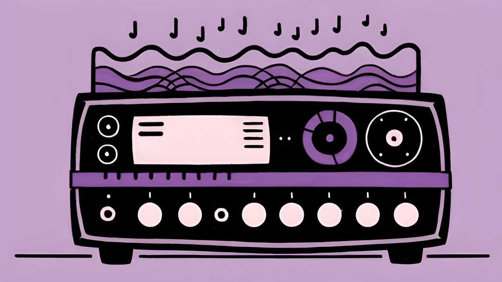
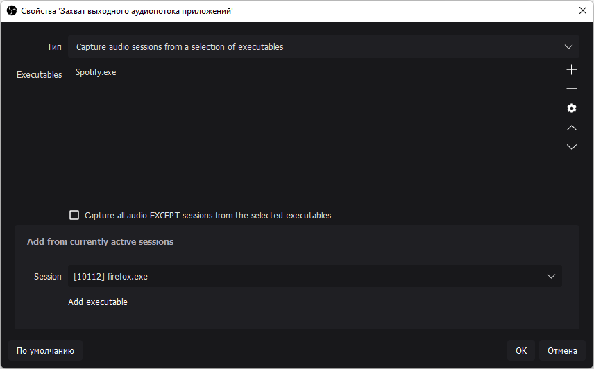
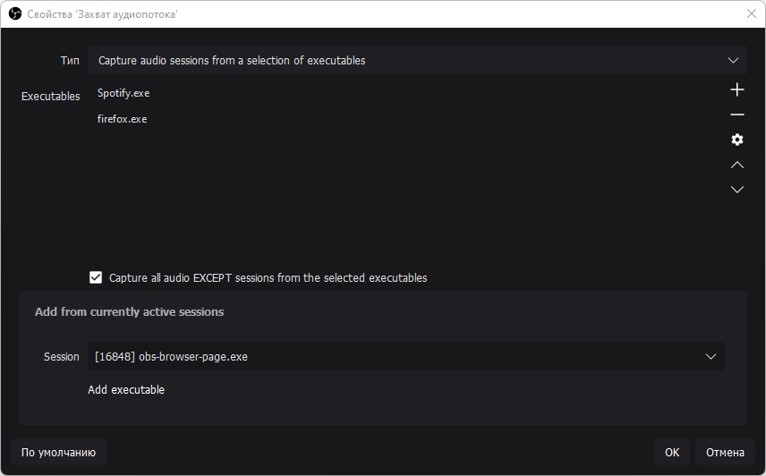
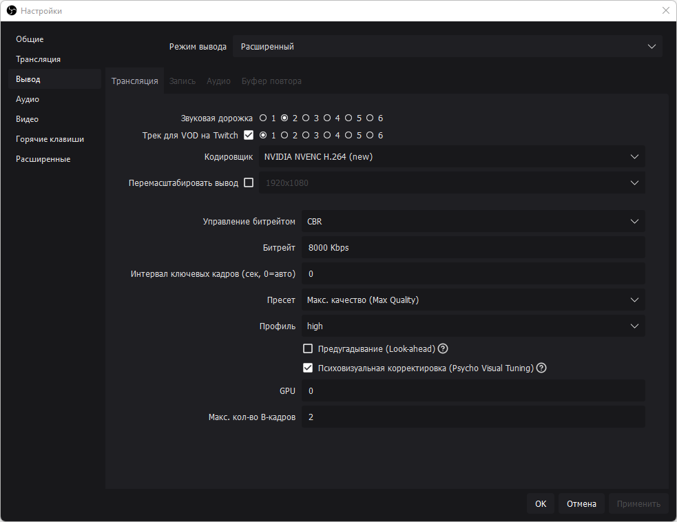
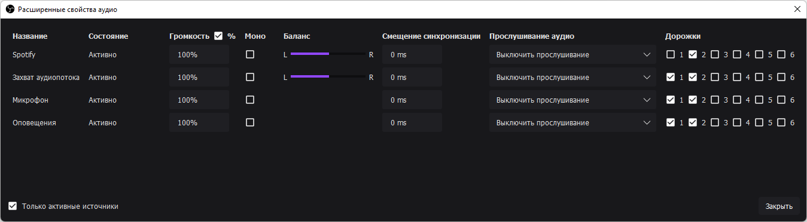

# Win Capture Audio

<figure><figcaption></figcaption></figure>

### Установка 

Скачать актуальную версию плагина из репозитория на GitHub. Установить с помощью `exe` или распаковать `zip` архив в корневую папку OBS.



### Добавление аудиодорожек для программ 

После установки плагина запускаем OBS Studio, добавляем новый источник аудио который будет отдельной аудиодорожкой. Правой кнопкой мыши в окне `Источники` → `Добавить` → `Захват выходного аудиопотока приложений`.

<figure><figcaption></figcaption></figure>

В появившемся окне, в разделе настроек `Add from currently active sessions`, в графе `Session` выбираем нужную программу (Она должна быть запущена). Например, `Spotify.exe`. Добавляем его кнопкой `Add executable`. Программа появится в списке `Executables`.

Дополнительно к этой дорожке можно добавить и другие программы, например браузер. На этом отдельная дорожка добавлена, к ней можно применять звуковые фильтры, лимитер и прочие настройки.

### Исключение программ из основного источника аудио 

Несмотря на то, что теперь в OBS есть отдельная дорожка для Spotify, звук из Spotify всё ещё будет воспроизводиться в основном источнике - в том, в котором воспроизводится звук игр и все остальные программы. Поэтому необходимо создать ещё один источник захвата выходного аудиопотока приложений в котором будут выводиться все звуки с компьютера кроме выбранных программ.

<figure><figcaption></figcaption></figure>

Точно так же, как и в предыдущем абзаце, добавляем источник захвата выходного аудиопотока приложений и в окне настроек добавляем программы которые будут исключены из основного источника аудио - для этого ставим галочку на параметре `Capture all audio EXCEPT sessions from the selected executables`.

После всех манипуляций не забудьте отключить свой стандартный источник звука, так как теперь вместо него добавился новый, с исключенными из аудиозахвата программами.

Что бы отключить основной источник звука в OBS откройте `Настройки` → `Вкладка Аудио` → Раздел `Глобальные настройки аудио`, в нём выключите основной источник `Аудио с рабочего стола` или `Микрофон/Дополнительное аудио`, если таковые есть.

### Twitch VOD - Убираем аудиодорожку из записи стрима 

Чтобы добавленная дорожка с музыкой Spotify не сохранялась в записи стрима на twitch, необходимо настроить параметры звуковых дорожек в OBS Studio.

<figure><figcaption>
Звуковая дорожка — Дорожка звук которой слышат ваши зрители на стриме. Трек для VOD на Twitch — Дорожка звук которой остаётся в записи стрима.
</figcaption></figure>

Открываем `Настройки OBS` → Вкладка `Вывод` - Отмечаем галочку `Трек для VOD на Twitch`, выбираем дорожку `1` → В параметре `Звуковая дорожка` выбираем дорожку `2`.

<figure><figcaption></figcaption></figure>

Переходим к настройкам дорожек в `Расширенных свойствах аудио`, которые находятся в контекстном меню правой кнопки мыши в `Микшере аудио`. Для Spotify отмечаем только дорожку `2` - та аудиодорожка которую слышат зрители когда стрим в эфире. У остальных источников отмечаем дорожки `1` и `2` - аудиодорожки для сохранённой записи стрима и, непосредственно, вывода звука в прямом эфире.
