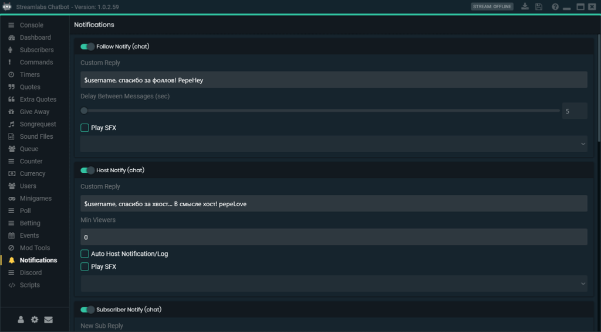

# Streamlabs Chatbot

Как может быть известно всем тем, кто так или иначе связан со стримингом и стримами, для автоматической модерации, оповещений и развлечения зрителей существуют чат-боты. Один из таких чат-ботов для twitch или youtube - бесплатная программа Streamlabs Chatbot.



### Установка и подключение <a href="#d1-83-d1-81-d1-82-d0-b0-d0-bd-d0-be-d0-b2-d0-ba-d0-b0-d0-b8-d0-bf-d0-be-d0-b4-d0-ba-d0-bb-d1-8e-d1-8" id="d1-83-d1-81-d1-82-d0-b0-d0-bd-d0-be-d0-b2-d0-ba-d0-b0-d0-b8-d0-bf-d0-be-d0-b4-d0-ba-d0-bb-d1-8e-d1-8"></a>

Скачиваем и устанавливаем сам Streamlabs Chatbot, а также необходимый для его работы `Python 2.7.13`. Программы лучше устанавливать в папки по умолчанию. Запускаем программу чат-бота где вас встретит помощник установки.



<div align="left"><figure><figcaption></figcaption></figure></div>

Выбираем платформу для стриминга. Создаём и авторизуем отдельный аккаунт для вашего бота, от имени которого он будет писать сообщения в чате.


На этом этапе отдельный аккаунт можно и не создавать, авторизоваться со своего основного, но тогда бот будет писать сообщения от его имени.


В следующих пунктах авторизуем свой основной аккаунт, а также логинимся в `streamlabs` с помощью всё того же `twitch` или `youtube`.

### Console <a href="#console" id="console"></a>

После успешной первичной настройки вы попадёте в окно консоли, где отображаются все сообщения чата, системные сообщения, список зрителей, поле для отправки сообщений в чат от имени стримера или бота.

У каждого сообщения имеются стандартные инструменты модерации - бан, таймаут или удаление сообщений. Вверху окна имеются кнопки макросов, о настройках которых будет рассказано позже.

<figure><figcaption></figcaption></figure>

### Dashboard <a href="#dashboard" id="dashboard"></a>

Окно настроек вашего стрима, работает только с `twitch`. Здесь можно выбрать категорию и название, запустить рекламу, если вы партнер, настроить автоматические хосты, в том числе для сообществ. Имеется помощник проведения рейдов. С его помощью можно провести рейд другого канала, а также указать количество баллов которые получат участники рейда.

<figure><figcaption></figcaption></figure>

Доступные команды чата:

| `!status` Название стрима | Изменяет название стрима  |
| ------------------------- | ------------------------- |
| `!game` The Witcher 3     | Изменяет категорию стрима |
| `!starthost`              | Запустить ретрансляцию    |
| `!stophost`               | Остановить ретрансляцию   |

### Commands <a href="#commands" id="commands"></a>

Раздел посвященный командам, в нём можно создавать свои собственные команды чата используя специальные переменные. Можно создавать свои группы для команд, например группа начинающаяся с `[GAME]`, будет работать только если вы стримите в категории этой игры. Пример `[GAME] The Outer Worlds`.

<figure><figcaption></figcaption></figure>

Доступные команды чата:

| `!command add` !фильм +r Сегодня мы смотрим фильм Джокер (2019) | Добавить команду `!фильм`, `+r` - Для группы `Regular`                            |
| --------------------------------------------------------------- | --------------------------------------------------------------------------------- |
| `!command edit` !фильм +a Сейчас мы смотрим фильм Чужой         | Отредактировать команду `!фильм`, `+a` - Для группы `Everyone`                    |
| `!command remove` !фильм                                        | Удалить команду `!фильм`                                                          |
| `!сommand add` !печеньки +a У нас $count печенек                | Добавить команду `!печеньки` с счетчиком                                          |
| `!сommand сount` !счетчик 10                                    | Добавить значение `10` к счетчику команды `!счётчик`                              |
| `!command usage` !фильм SC                                      | Принцип использования [SC, SW, SB, DC, DW, DB, CB, WB, A](#user-content-fn-1)[^1] |
| `!enable` !фильм true                                           | Включить или выключить команду, `true` или `false` соответственно                 |
| `!command cooldown` !фильм 2                                    | Установить глобальный лимит времени через который можно использовать команду      |
| `!command usercooldown` !фильм 5                                | Установить персональный лимит времени через который можно использовать команду    |

Кликнув правой кнопкой мыши на команде её можно экспортировать в файл. Аналогично можно импортировать команды из файлов.

### Timers <a href="#timers" id="timers"></a>

Это раздел для создания таймеров — сообщений которые бот будет публиковать в чат автоматически, через определенное время. Интервал времени можно указать нажав на шестерёнку в правом верхнем углу раздела. Так как все таймеры следуют одному и тому же интервалу, бот опубликует сначала первый, затем второй и так далее, по кругу.

Таймеры также можно разделять по группам, указывать им префикс `[GAME] Название игры` и эти таймеры будут работать только на стримах этой игры.

<figure><figcaption></figcaption></figure>

Доступные команды чата:

| `!timer add` !meow /me мяукнула на $randusername | Добавляет команду по таймеру                                     |
| ------------------------------------------------ | ---------------------------------------------------------------- |
| `!timer edit` !meow /me шипит на $randusername   | Редактирует таймер                                               |
| `!timer remove` !meow                            | Удаляет таймер                                                   |
| `!activate` !meow false                          | Включить или выключить таймер, `true` или `false` соответственно |

### Quotes <a href="#quotes" id="quotes"></a>

Здесь можно собирать крылатые цитаты сказанные вами во время стрима. Нажав шестеренку в правом верхнем углу раздела, вы можете настроить кому разрешено пользоваться командой и кому можно добавлять новые цитаты, выбрать формат даты и сам формат отображения цитаты. Каждая цитата будет содержать информацию о дате и рубрике стрима на момент её создания.

<figure><figcaption></figcaption></figure>

Доступные команды чата:

| `!quote add` «Только те, кто предпринимают абсурдные попытки, смогут достичь невозможного» - AlbertEinstein | Добавляет цитату в список        |
| ----------------------------------------------------------------------------------------------------------- | -------------------------------- |
| `!quote edit` 12 «Самое непостижимое в этом мире - это то, что он постижим.» - AlbertEinstein               | Редактирует цитату с `id12`      |
| `!quote remove` 12                                                                                          | Удаляет цитату с `id12`          |
| `!quote`                                                                                                    | Публикует случайную цитату в чат |
| `!quote` 12                                                                                                 | Публикует в чат цитату с `id12`  |

### Extra Quotes <a href="#extra-quotes" id="extra-quotes"></a>

Аналогично разделу `Quotes` здесь можно добавлять любой контент, но в отличие от команды `!quote` здесь имя команды может быть любым, например `!gif`. Также можно включить или выключить отображение даты и рубрики у элемента команды.

<figure><figcaption></figcaption></figure>

Доступные команды чата:

| `!gif add` https://media.giphy.com/media/g7GKcSzwQfugw/giphy.gif     | Добавляет ссылку в список       |
| -------------------------------------------------------------------- | ------------------------------- |
| `!gif edit` 16 https://media.giphy.com/media/g7GKcSzwQfugw/giphy.gif | Редактирует ссылку с `id16`     |
| `!gif remove` 16                                                     | Удаляет ссылку с `id16`         |
| `!gif`                                                               | Публикует случайную гифку в чат |
| `!gif` 16                                                            | Публикует гифку с `id16`        |

### Give Away <a href="#give-away" id="give-away"></a>

Раздел посвященный раздачам. Здесь можно пригласить зрителей участвовать в раздаче чего бы то ни было, выбрать стоимость «билета» для участия в раздаче, если в настройках бота включена внутренняя валюта. Также можно отслеживать сколько у зрителя «билетов» и количество его сообщений в чате.

<figure><figcaption></figcaption></figure>

Доступные команды чата:

| `!giveaway start` !raffle\|cookies\|1\|25\|regular | !команда \| приз \| количество победителей \| стоимость участия \| группа пользователей |
| -------------------------------------------------- | --------------------------------------------------------------------------------------- |
| `!giveaway start` !raffle\|cookies\|everyone       | !команда \| приз \| группа пользователей                                                |
| `!giveaway close`                                  | Закрыть раздачу                                                                         |
| `!giveaway winner`                                 | Выбрать победителя                                                                      |

### Songrequest <a href="#songrequest" id="songrequest"></a>

Система заказа музыки позволит создать свой плейлист воспроизведения музыки с YouTube, а также позволит зрителям заказывать музыку через чат, в том числе за баллы бота.

<figure><figcaption></figcaption></figure>

Доступные команды чата:

| `!songrequest` dQw4w9WgXcQ          | Заказать музыку, `id` или ссылка на трек с YouTube. |
| ----------------------------------- | --------------------------------------------------- |
| `!skip`                             | Проголосовать за пропуск текущего трека             |
| `!veto`                             | Пропустить текущий трек                             |
| `!wrongsong`                        | Удаляет последний заказанный трек из списка         |
| `!songlist`                         | Список треков                                       |
| `!songblacklist add` dQw4w9WgXcQ    | Добавить `id` трека в черный список                 |
| `!songblacklist remove` dQw4w9WgXcQ | Удалить `id` трека из черного списка                |
| `!volume` 50                        | Установить громкость плеера на `50%`                |

### Sound Files <a href="#sound-files" id="sound-files"></a>

Здесь можно добавить воспроизведение звуковых файлов привязанных к командам чата. У каждого файла есть настройка громкости, сколько раз команда должна быть написана в чате, для воспроизведения и прочие настройки прав для использования.

<figure><figcaption></figcaption></figure>

### Queue <a href="#queue" id="queue"></a>

Здесь можно создать очередь чтобы зрители могли подключаться к вашей мультиплеерной игре. Можно настроить стоимость в баллах бота, либо дать возможность занимать очередь только платным подписчикам.

<figure><figcaption></figcaption></figure>

Доступные команды чата:

| `!queue open` Left 4 Dead 2 | Открыть очередь на присоединение к игре   |
| --------------------------- | ----------------------------------------- |
| `!queue close`              | Закрыть очередь                           |
| `!queue clear`              | Очистить очередь                          |
| `!queue pick` 3             | Взять троих ближайших зрителей из очереди |
| `!queue random` 3           | Взять троих случайных зрителей из очереди |
| `!queuelist`                | Посмотреть список очереди                 |
| `!join`                     | Присоединиться к очереди                  |
| `!leave`                    | Покинуть очередь                          |

### Counter <a href="#counter" id="counter"></a>

Счётчик можно использовать для вывода на стрим количества смертей при прохождении игры. Так, например, делают некоторые стримеры при прохождении игр вроде Dark Souls.

В целом, настройки счётчика можно изменить под что угодно, главное чтобы в поле `Message Template` был символ `#`, он будет заменён на число счётчика при его отображении. Вывести счётчик смертей в OBS можно используя файл `death.txt`, который находится в каталоге бота, по пути:

```shell
C:\Users\Имя Пользователя\AppData\Roaming\Streamlabs\Streamlabs Chatbot\Services\Twitch\Files
```

В этом же каталоге можно найти множество других `txt` файлов, которые можно использовать для вывода разной статистики на экране стрима.

<figure><figcaption></figcaption></figure>

Доступные команды чата:

| `!death` +  | Добавить `+1` смерть к количеству смертей |
| ----------- | ----------------------------------------- |
| `!death` -  | Отнять `−1` смерть от количества смертей  |
| `!death` 10 | Установить количество смертей `10`        |
| `!death`    | Посмотреть текущее количество смертей     |

### Currency <a href="#currency" id="currency"></a>

В данном разделе можно включить систему баллов, которые участники чата смогут получать на основе выбранных настроек.

Баллы можно тратить в раздачах, голосованиях, играх и в целом в любых командах чата. В настройках можно указать количество получаемых баллов, период их получения, настроить группы и так далее.

<figure><figcaption></figcaption></figure>

Доступные команды чата:

| `!points add` enotPoloskun 10000    | Добавить `10000` баллов зрителю `enotPoloskun`             |
| ----------------------------------- | ---------------------------------------------------------- |
| `!points remove` enotPoloskun 500   | Отнять `500` баллов у зрителя `enotPoloskun`               |
| `!points add` +viewers 100          | Добавить `100` баллов каждому зрителю в чате               |
| `!points remove` +viewers 100       | Отнять `100` баллов у каждого зрителя в чате               |
| `!points`                           | Узнать своё количество баллов                              |
| `!transfer` enotPoloskun honeymoney | Передать баллы зрителя `enotPoloskun` зрителю `honeymoney` |

### Users <a href="#users" id="users"></a>

В этой вкладке находится список всех зрителей канала, их `id`, никнейм, текущая роль прав, история блокировок, время последнего посещения, количество проведённых рейдов.

Здесь можно редактировать их права, назначать редакторов команд бота, смотреть и изменять количество баллов, если они включены.

<figure><figcaption></figcaption></figure>

### Poll <a href="#poll" id="poll"></a>

Система опросов позволяет запускать голосование в чате. При желании можно сделать голосование платным за баллы.

<figure><figcaption></figcaption></figure>

Доступные команды чата:

| `!poll start` Какую игру проходить следующей?\|10\|1\|false\|Witcher\|Minecraft | Вопрос голосования \| Стоимость в баллах \| Максимальное количество голосов \| Несколько вариантов голосования (true/false) \| Варианты ответов |
| ------------------------------------------------------------------------------- | ----------------------------------------------------------------------------------------------------------------------------------------------- |
| `!poll start` Какую игру проходить следующей?\|Witcher III\|Minecraft           | Вопрос голосования \| Варианты ответов                                                                                                          |
| `!poll stop`                                                                    | Остановить голосование                                                                                                                          |
| `!vote` 1                                                                       | Проголосовать за вариант `1`                                                                                                                    |

### Betting <a href="#betting" id="betting"></a>

Система ставок с помощью которой зрители могут делать ставки на исход той или иной ситуации, выигрывая баллы. В настройках можно выбирать один или несколько выигрышных вариантов.

<figure><figcaption></figcaption></figure>

Доступные команды чата:

| `!betting start` Будет хорошая или плохая концовка?\|35\|1\|100\|true\|да\|нет\|не знаю | На что делается ставка \| Процент выигрыша \| Минимальная ставка \| Максимальная ставка \| Несколько вариантов ответа (true/false) \| Варианты ответа |
| --------------------------------------------------------------------------------------- | ----------------------------------------------------------------------------------------------------------------------------------------------------- |
| `!betting start` Будет хорошая или плохая концовка?\|да\|нет\|не знаю                   | На что делается ставка \| Варианты ответа                                                                                                             |
| `!betting stop`                                                                         | Запретить делать ставки                                                                                                                               |
| `!betting abort`                                                                        | Завершает и возвращает сделанные ставки                                                                                                               |
| `!betting winner` 28                                                                    | Выбрать выигрышный `id`                                                                                                                               |
| `!bet` 1 1000                                                                           | Сделать ставку `1000` баллов на вариант ответа с `id1`                                                                                                |

### Events <a href="#events" id="events"></a>

Система событий позволяет боту автоматически приветствовать выбранного пользователя, текстом или проигрыванием аудио. При выбранном параметре `Join Events` срабатывает, когда зритель присоединяется к каналу. При `Speak Events` срабатывает, когда зритель напишет в чат.

<figure><figcaption></figcaption></figure>

### Mod Tools <a href="#mod-tools" id="mod-tools"></a>

В этом разделе можно настроить автоматическую модерацию чата, удалять сообщения зрителей со ссылками, капсом, символами или запрещенными словами, настраивать систему наказаний за запрещенные сообщения, будь то просто удаление сообщения, таймаут или бан за повторные нарушения.

<figure><figcaption></figcaption></figure>

### Notifications <a href="#notifications" id="notifications"></a>

В этом разделе можно настроить различные оповещения: при подписке на канал, при платной подписке, хосте, рейде. В том числе можно сделать звуковые оповещения.

<figure><figcaption></figcaption></figure>

### Discord <a href="#discord" id="discord"></a>

Этот раздел позволит настроить функции бота для вашего Discord канала. Оповещения о запуске стрима, сообщения по таймеру и автоматическое назначение роли новым участникам.

<figure><figcaption></figcaption></figure>

### Settings <a href="#settings" id="settings"></a>

#### General <a href="#general" id="general"></a>

В этом разделе можно настроить основные функции, такие как автоматическое подключение бота к чату, аудиовыходы, отображение счётчика зрителей и так далее.

<figure><figcaption></figcaption></figure>

#### Localization <a href="#localization" id="localization"></a>

Раздел который позволяет перевести сообщения бота на любой другой язык.

<figure><figcaption></figcaption></figure>

#### Usage <a href="#usage" id="usage"></a>

Здесь можно настроить где и как можно использовать команды бота.

<figure><figcaption></figcaption></figure>

#### Macros <a href="#macros" id="macros"></a>

Здесь можно настроить сообщения макросов для семи различных кнопок, чтобы публиковать команды/сообщения в чате когда вы нажимаете на них.

<figure><figcaption></figcaption></figure>

#### Hotkeys <a href="#hotkeys" id="hotkeys"></a>

С помощью горячих клавиш можно настроить включение и отключение треков из `Songrequest`, пропуск, увеличение и уменьшение громкости. Также здесь можно настроить клавиши для макросов из предыдущего раздела настроек.

<figure><figcaption></figcaption></figure>

#### Style <a href="#style" id="style"></a>

Настройки внешнего вида бота, можно выбрать из нескольких скинов или выбрать свои цвета для разных элементов.

<figure><figcaption></figcaption></figure>

### Официальная документация <a href="#d0-bf-d0-be-d0-bb-d0-b5-d0-b7-d0-bd-d1-8b-d0-b5-d1-81-d1-81-d1-8b-d0-bb-d0-ba-d0-b8" id="d0-bf-d0-be-d0-bb-d0-b5-d0-b7-d0-bd-d1-8b-d0-b5-d1-81-d1-81-d1-8b-d0-bb-d0-ba-d0-b8"></a>



[^1]: SC — Stream Chat

    SW — Stream Whisper

    SB — Stream Both

    DC — Discord Chat

    DW — Discord Whisper

    DB — Discord Both

    CB — Chat Both

    WB — Whisper Both

    A — All
