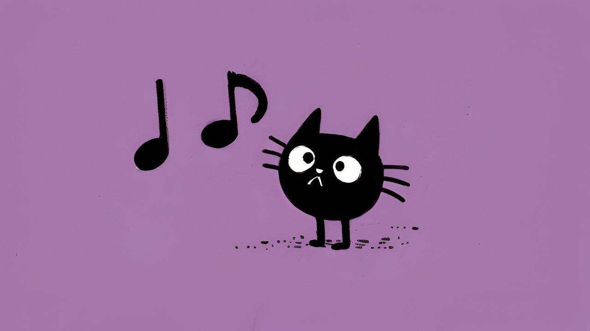

# Текущий музыкальный трек по команде в чате

<figure><figcaption></figcaption></figure>

Если вы проигрываете фоновую музыку на стриме из сервиса Яндекс.Музыки или Вконтакте, а зрители достают вас вопросом о том, какой трек сейчас играет, есть небольшое решение для Streamlabs Chatbot.

1. Для начала понадобится аккаунт на [last.fm](http://last.fm/), создаем аккаунт, если у вас его ещё нет. Для справки — last.fm с помощью плагинов к медиаплеерам собирает информацию о музыке, которую слушают пользователи, и на основе полученных данных автоматически составляет индивидуальные и общие чарты.
2. Устанавливаем плагин [Web Scrobbler](https://chrome.google.com/webstore/detail/web-scrobbler/hhinaapppaileiechjoiifaancjggfjm) для Google Chrome (Или любого другого браузера на Chromium).
3. Авторизуем свой last.fm аккаунт в настройках плагина, чтобы он мог записывать названия проигрываемых треков в last.fm.
4. Теперь [скачиваем плагин](https://github.com/camalot/chatbot-gpmdp/releases) для Streamlabs Chatbot, который выводит текущий трек из last.fm, и устанавливаем его.



После установки в настройках плагина можно настроить команду для вывода текущего трека в чат, тип отображения названия песни, а также сообщение бота в случае если музыка в данный момент не играет.


[script-install.md](script-install.md)

