# 🎵 Разделение аудиодорожек

### Плагин Win Capture Audio

Плагин позволяет создавать отдельные источники звука из любых программ, работает на Windows 11 и Windows 10 версии 2004 и выше.

#### Установка 

Скачать актуальную версию плагина из репозитория на GitHub. Установить с помощью `exe` или распаковать `zip` архив в корневую папку OBS.



#### Добавление аудиодорожек для программ 

После установки плагина запускаем OBS Studio, добавляем новый источник аудио который будет отдельной аудиодорожкой. Правой кнопкой мыши в окне `Источники` → `Добавить` → `Захват выходного аудиопотока приложений`.

<figure>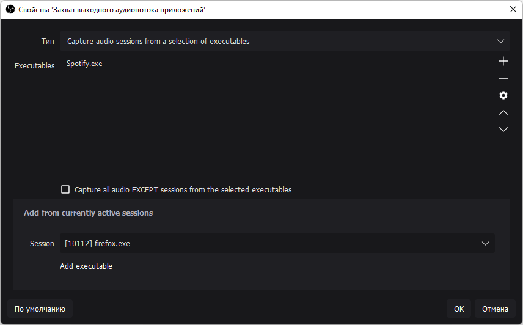<figcaption></figcaption></figure>

В появившемся окне, в разделе настроек `Add from currently active sessions`, в графе `Session` выбираем нужную программу (Она должна быть запущена). Например, `Spotify.exe`. Добавляем его кнопкой `Add executable`. Программа появится в списке `Executables`.&#x20;

Дополнительно к этой дорожке можно добавить и другие программы, например браузер. На этом отдельная дорожка добавлена, к ней можно применять звуковые фильтры, лимитер и прочие настройки.

#### Исключение программ из основного источника аудио 

Несмотря на то, что теперь в OBS есть отдельная дорожка для Spotify, звук из Spotify всё ещё будет воспроизводиться в основном источнике - в том, в котором воспроизводится звук игр и все остальные программы. Поэтому необходимо создать ещё один источник захвата выходного аудиопотока приложений в котором будут выводиться все звуки с компьютера кроме выбранных программ.

<figure>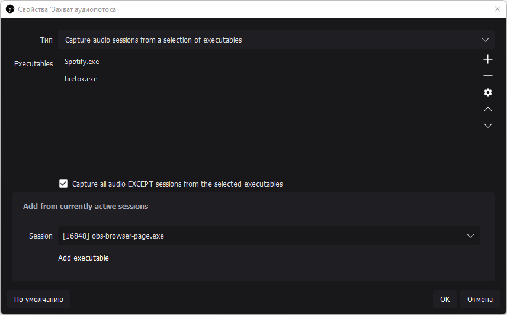<figcaption></figcaption></figure>

Точно так же, как и в предыдущем абзаце, добавляем источник захвата выходного аудиопотока приложений и в окне настроек добавляем программы которые будут исключены из основного источника аудио - для этого ставим галочку на параметре `Capture all audio EXCEPT sessions from the selected executables`.

После всех манипуляций не забудьте отключить свой стандартный источник звука, так как теперь вместо него добавился новый, с исключенными из аудиозахвата программами.&#x20;

Что бы отключить основной источник звука в OBS откройте `Настройки` → `Вкладка Аудио` → Раздел `Глобальные настройки аудио`, в нём выключите основной источник `Аудио с рабочего стола` или `Микрофон/Дополнительное аудио`, если таковые есть.

#### Twitch VOD - Убираем аудиодорожку из записи стрима 

Чтобы добавленная дорожка с музыкой Spotify не сохранялась в записи стрима на twitch, необходимо настроить параметры звуковых дорожек в OBS Studio.

<figure>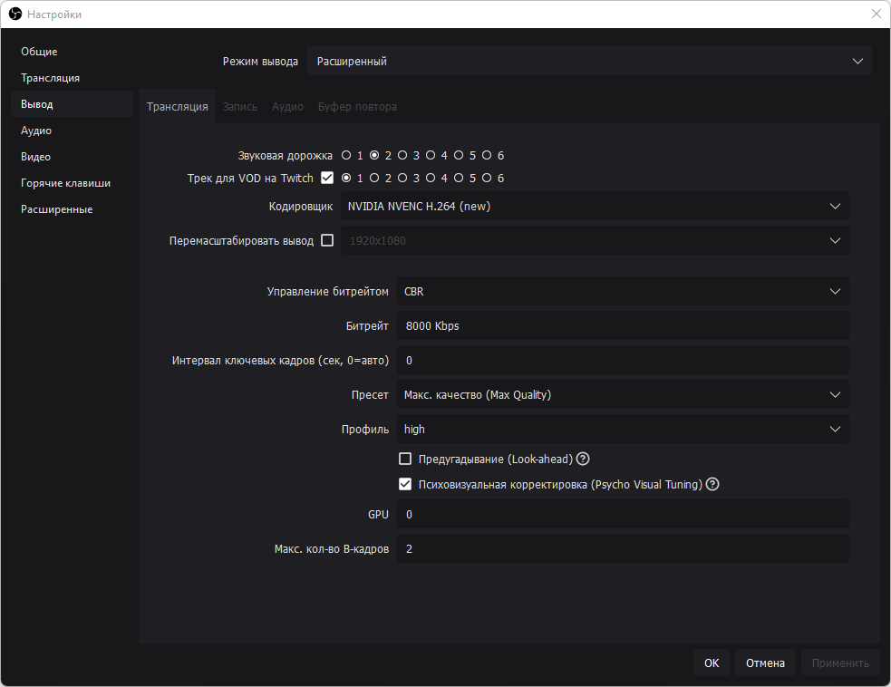<figcaption>
Звуковая дорожка — Дорожка звук которой слышат ваши зрители на стриме. Трек для VOD на Twitch — Дорожка звук которой остаётся в записи стрима.
</figcaption></figure>

Открываем `Настройки OBS` → Вкладка `Вывод` - Отмечаем галочку `Трек для VOD на Twitch`, выбираем дорожку `1` → В параметре `Звуковая дорожка` выбираем дорожку `2`.

<figure>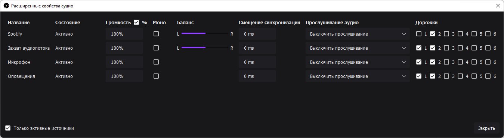<figcaption></figcaption></figure>

Переходим к настройкам дорожек в `Расширенных свойствах аудио`, которые находятся в контекстном меню правой кнопки мыши в `Микшере аудио`. Для Spotify отмечаем только дорожку `2` - та аудиодорожка которую слышат зрители когда стрим в эфире. У остальных источников отмечаем дорожки `1` и `2` - аудиодорожки для сохранённой записи стрима и, непосредственно, вывода звука в прямом эфире.

### Voicemeeter Banana

Ещё один, менее современный, метод разделения аудиодорожек.

Для настройки понадобится пару программ - [Voicemeeter Banana](https://vb-audio.com/Voicemeeter/banana.htm) и [Virtual Audio Cable A+B](https://rutracker.org/forum/viewtopic.php?t=5716384). Устанавливаем VBCable A и VBCable B от имени администратора, затем устанавливаем сам Voicemeeter Banana и перезагружаем компьютер.



#### Настройка Windows 10 

После установки программ, в своей Windows 10 откроем `Параметры` → `Система` → Вкладка `Звук` → В правой колонке `Панель управления звуком`.

<figure>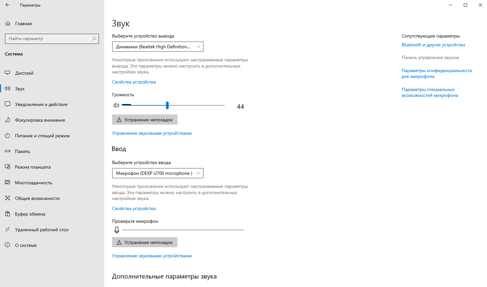<figcaption></figcaption></figure>

В появившемся окне, во вкладке `Воспроизведение` отключаем `Voicemeeter Aux Input` (Правой кнопкой мыши — Отключить), во вкладке `Запись` отключаем `Voicemeeter Aux Output`, так как они нам не нужны.&#x20;

В списке устройств должно получится примерно следующее, но в зависимости от ваших устройств может быть по-другому, главное чтобы устройства `VB-Audio` были такими:

<figure>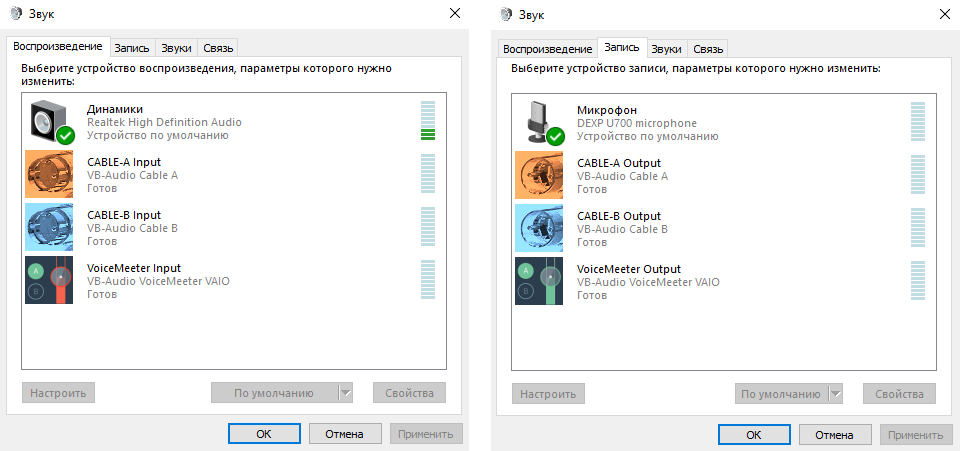<figcaption></figcaption></figure>

Во вкладке `Воспроизведение` откройте свойства вашего основного источника звука, в моём случае это `Динамики`, во вкладке `Уровни` выставьте громкость на максимум, в дальнейшем регулировка громкости будет происходить через Voicemeeter Banana.

Теперь, всё в той же вкладке `Воспроизведение`, нажмите правой кнопкой мыши на `Voicemeeter Input` и выберете `Использовать по умолчанию`, а также `Использовать устройство связи по умолчанию`. Если через Voicemeeter планируете настраивать не только источник звука, но и микрофон, во вкладке `Звук` проделайте то же самое с устройством `Voicemeeter Output`.

<figure>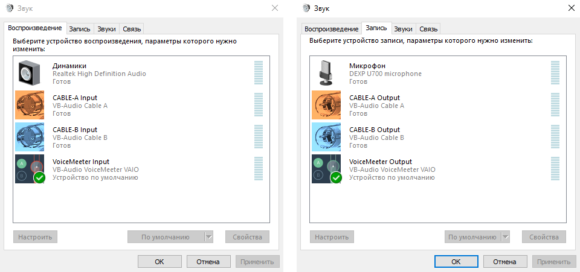<figcaption></figcaption></figure>

После этого запускаем Voicemeeter Banana.

#### Настройка Voicemeeter Banana 

<figure>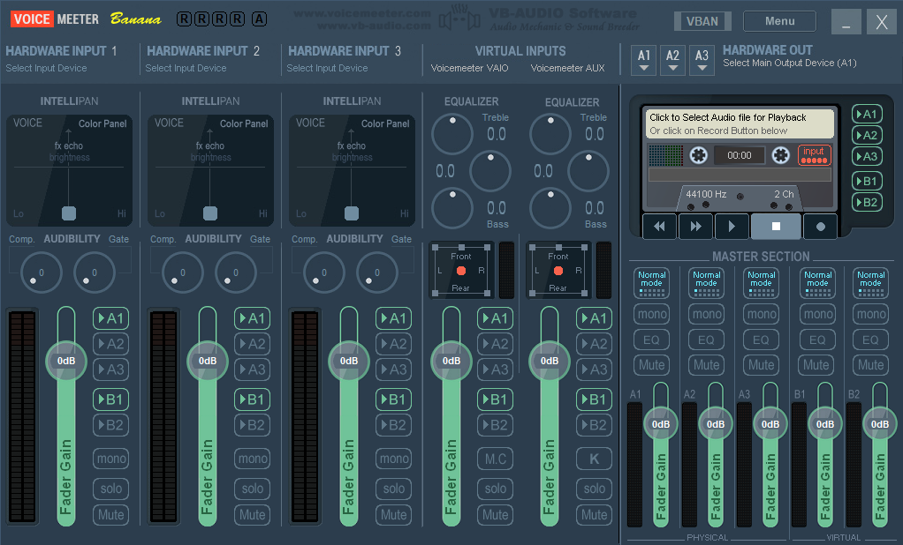<figcaption></figcaption></figure>

Здесь, в самой правой колонке - `Hardware Out`, кликаем `А1` и выберем своё основное устройство источника звука, это ваши колонки или наушники, у меня это `WDM: Динамики (Realtek High Definition Audio)`. Если устройство выбрано правильно ваш воспроизводимый звук должен будет отображаться на волюметре в графе `A1` в `Master Section`, а также должен будет прослушиваться в наушниках или колонках, но уже непосредственно через Voicemeeter Banana.

Далее, в первой колонке — `Hardware Input 1` выбираем свой микрофон, если конечно будете использовать его через Voicemeeter Banana. У меня это `WDM: Микрофон (Dexp U700 microphone)`. Чтобы не слышать звук с микрофона, здесь же в настойках `Hardware Input 1`, отключите дорожку `А1`. Дорожку `B1` нужно оставить включенной.

В колонке `Hardware Input 2` выбираем устройство `WDM: CABLE-A Output (VB-Audio Cable A)` и оставляем ему только дорожку `А1`. В `Hardware Input 3` выбираем устройство `WDM: CABLE-B Output (VB-Audio Cable B)` и также оставляем ему дорожку `А1`.

После всех манипуляций получаются следующие настройки:

<figure>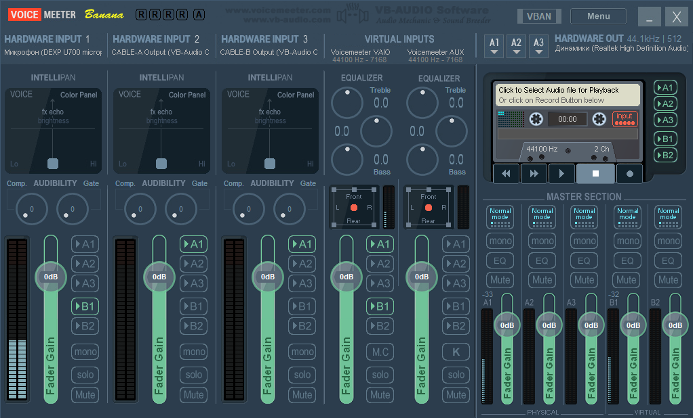<figcaption></figcaption></figure>

Теперь откроем меню по соответствующей кнопке `Menu` в правом верхнем углу Voicemeeter Banana. Здесь нужно поставить галочки на `System Tray` и на `Run on Windows Startup`, чтобы Voicemeeter автоматически запускался при включении компьютера.

В этом же меню, во вкладке `Shortcut Key (Hook)...` ставим галочку на `Hook Volume Keys (For Level Output A1)`, это нужно для того, чтобы можно было прибавлять и уменьшать громкость хоткеями на клавиатуре, как правило, это `Fn + F10` и `Fn + F11`, так как стандартными ползунками громкости в Windows управлять мы больше не можем. Если горячих клавиш для звука на клавиатуре нет, громкостью можно управлять ползунком `Fader Gain А1` в `Master Section`. Непосредственно на этом настройка Voicemeeter Banana закончена.

#### Распределение по виртуальным устройствам 

Наконец пустим аудио разных программ на разные виртуальные устройства, для этого снова откроем `Параметры` в Windows → `Система` → Вкладка `Звук` → Внизу ищем `Дополнительные параметры звука`, кликаем на `Параметры устройств и громкости приложений` и наблюдаем параметры устройств для текущих открытых приложений.

<figure>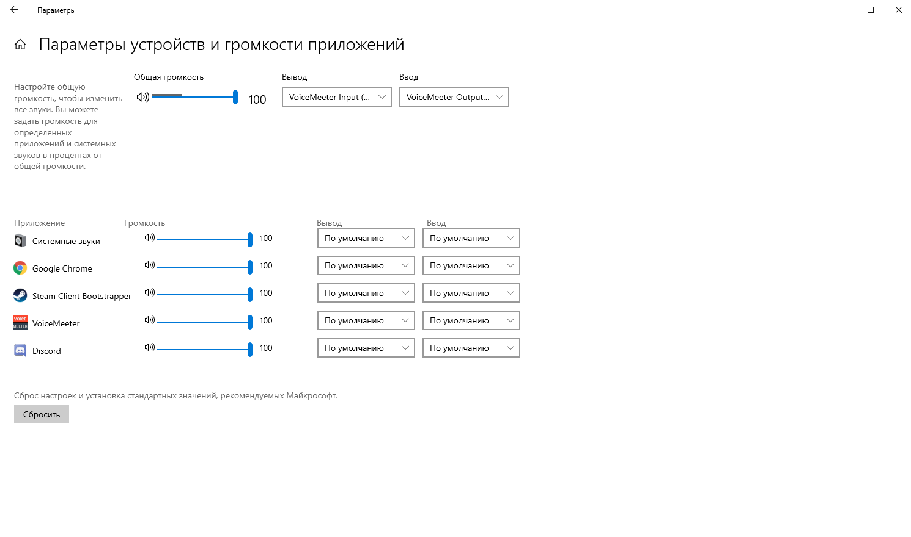<figcaption></figcaption></figure>

Здесь у любой нужной программы в графе параметров `Вывод` мы можем указать новое устройство вывода звука, которое станет отдельным источником аудио в вашем OBS или любой другой программе для стриминга, если она поддерживает несколько аудио источников. При этом мы всё также будем слышать звук с этих виртуальных устройств благодаря Voicemeeter Banana.

Например, для Google Chrome можно выбрать устройство `CABLE-B Input (VB-Audio Cable B)`, а для Discord `CABLE-A Input (VB-Audio Cable A)`.

<figure>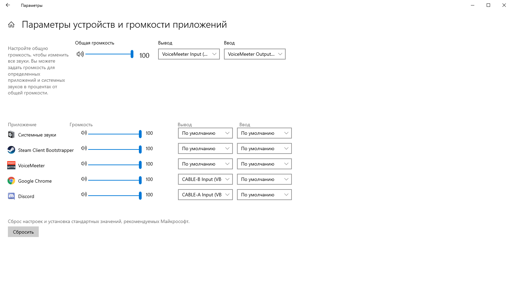<figcaption></figcaption></figure>

#### Настройка OBS Studio 

После распределения нужных программ по виртуальным устройствам откроем свой любимый OBS Studio и перейдем в `Настройки` → Вкладка `Аудио`.

Здесь, в разделе `Глобальные устройства аудио`, в `Аудио с рабочего стола` укажем устройство `VoiceMeeter Input (VB-Audio VoiceMeeter VAIO)`, в `Микрофон/Дополнительное аудио` укажем устройство `VoiceMeeter Output (VB-Audio VoiceMeeter VIAO)`, в `Микрофон/Дополнительное аудио 2` укажем `CABLE-A Output (VB-Audio Cable A)`, в `Микрофон/Дополнительное аудио 3` укажем `CABLE-B Output (VB-Audio Cable B)`.

В конечном итоге получаются следующие настройки:

<figure>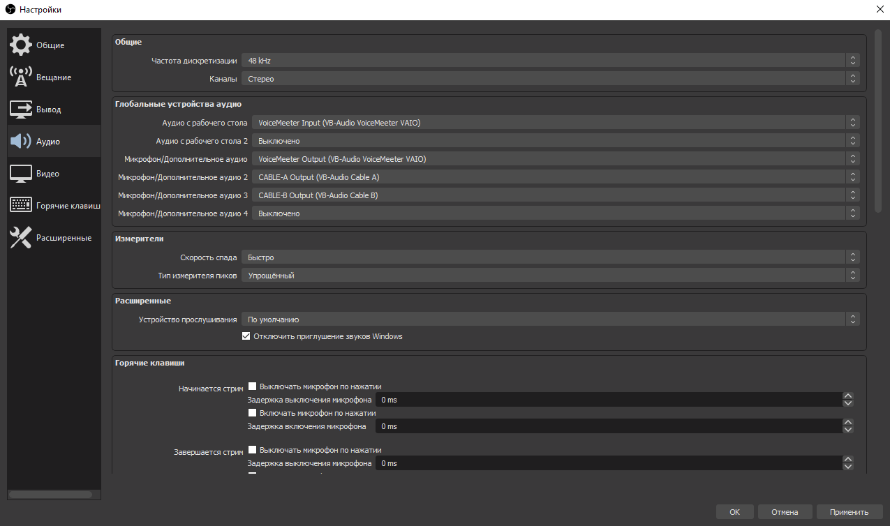<figcaption></figcaption></figure>

Теперь все наши виртуальные источники звука, или же раздельные источники для программ, появятся в `Микшере аудио` в OBS, где звук из Google Chrome будет идти на виртуальное устройство `Cable B`, а звук из Discord будет идти на `Cable A`. Для каждого из этих устройств можно установить свою громкость, фильтры и горячие клавиши, а можно вообще выключить их звук в OBS и тогда звук с этих устройств будете слышать только вы, но не ваши зрители.

#### Twitch VOD для OBS Studio 

А ещё, с появлением в OBS настройки VOD (Video on Demand) дорожки для Twitch, можно настроить отдельное устройство которое не будет записываться в VOD твича, а лишь проигрываться непосредственно на стриме в эфире, что позволит избежать сохранение музыки с авторскими правами в записи вашей трансляции после стрима.

Откройте в OBS `Настройки` → `Вывод` → Вкладка `Потоковое вещание` и укажите дорожку для аудио которая не будет оставаться в записи стрима.

<figure>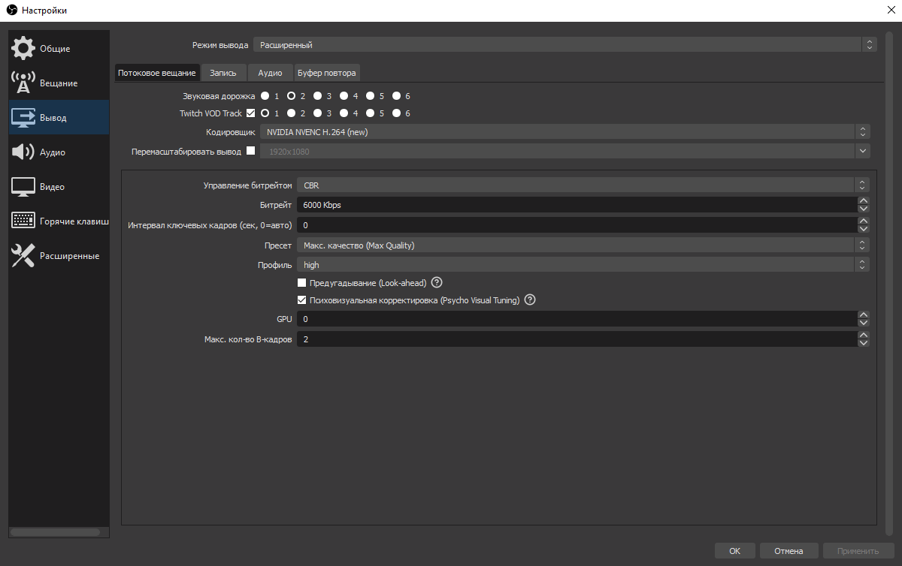<figcaption></figcaption></figure>

Так `Звуковая дорожка` два - это та дорожка которая не будет записываться в архивную запись после стрима. Дорожка один, с галочкой `Twitch VOD Track`, это та дорожка звук с которой останется на записи стрима.

Чтобы выбрать нужные дорожки для нужных устройств в `Микшере аудио` нажмите правой кнопкой мыши и кликните `Расширенные свойства аудио`. Например, для источника `Cable B` оставляем только дорожку `2`, а для других источников все дорожки, кроме дорожки `2`.

<figure>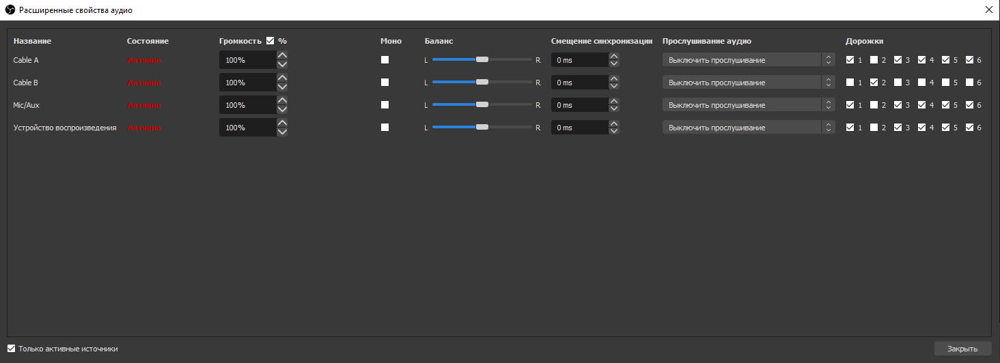<figcaption>
Обратите внимание на правильность расставленных галочек у дорожек.
</figcaption></figure>

Таким образом через виртуальное устройство Cable B можно прослушивать музыку на стриме и этой музыки не будет в записи стрима.

_На этом всё, вы настроили Voicemeeter Banana для стримов и вы великолепны._

### Разные аудиодорожки на разных стримах

Бывают ситуации когда при рестриме на разные площадки, например на youtube и twitch одновременно, необходимо сделать так, чтобы музыка на одной из площадок не воспроизводилась во время стрима, а на другой наоборот - воспроизводилась.

Например нужно, чтобы заказанные через donationalerts музыкальные клипы с авторским правом не воспроизводились на youtube и их могли слышать только зрители на twitch. Либо вы хотите транслировать фоновую музыку во время игры, но не хотите получить страйк за авторские права на youtube - логично выводить музыку только на ту площадку, где вам не грозит бан.


К слову, твич самостоятельно вырезает музыку с авторскими правами из записи VOD, но можно разделить дорожки так, чтобы музыка вообще не попадала в VOD твича, на всякий случай.


Для рестрима на две площадки и вывода отдельных дорожек понадобится плагин Multiple RTMP для OBS Studio.


[restrim-s-raznym-bitreitom.md](restrim-s-raznym-bitreitom.md)


Добавьте первый источник стрима, например youtube. Укажите `RTMP Сервер` и `RTMP Ключ`. В блоке `Настройки Аудио` выберете `Стандартный AAC-кодер FFmpeg`, выберете битрейт аудио - `128`, `160` или `320`, в зависимости от предпочтений. В графе `Audio Track` укажите дорожку для youtube, пусть это будет дорожка `1`.

<figure><figcaption></figcaption></figure>

Затем добавьте вторую площадку, например twitch. Аналогично укажите `RTMP Сервер` и `RTMP Ключ` трансляции для твича. В разделе `Настройки Аудио` укажите всё тоже самое, что и в предыдущих настройках, но в графе `Audio Track` выберете аудиодорожку под номером `2`.

<figure>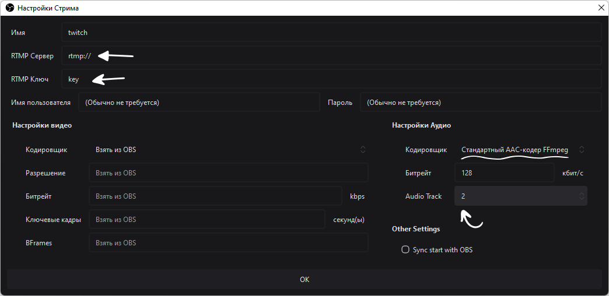<figcaption></figcaption></figure>

Теперь, в микшере звука OBS источники звука с дорожкой `1` будут воспроизводиться только для youtube, а источники с дорожкой `2` - только для twitch. Источники где выбрана дорожка `1` и `2` будут воспроизводиться на обеих площадках.

#### Добавляем источник аудио и выбираем его дорожку 

В источниках добавьте источник браузера, можно назвать его `Размещение медиа`. Укажите ссылку вывода заказанного медиа с donationalerts. В настройках поставьте галочку `Управление аудио через OBS` - так как теперь вы будете прослушивать и выбирать аудиодорожку этого источника непосредственно через сам OBS.

<figure>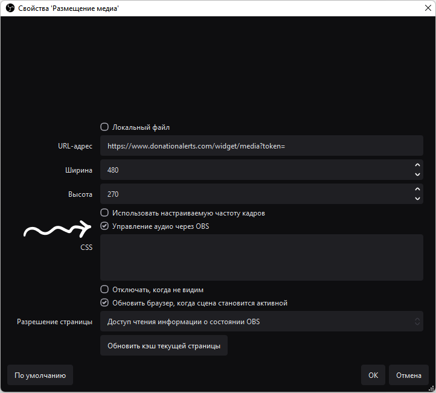<figcaption></figcaption></figure>

Откройте микшер OBS и выберете для источника Размещение медиа дорожку `2` - ту дорожку которая выводится через Multiple RTMP только для стрима на twitch. В столбце `Прослушивание аудио` выберете `Прослушивание и вывод`, чтобы прослушивать заказанную музыку только через OBS, а не общий источник аудио.

<figure>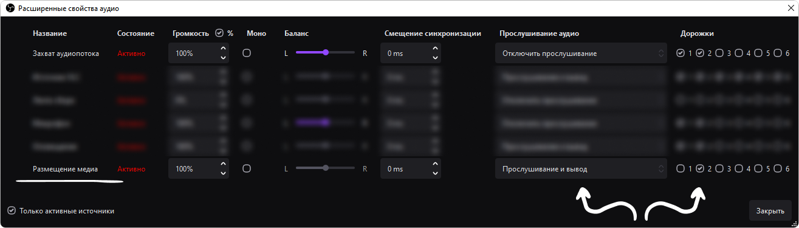<figcaption></figcaption></figure>

#### Исключаем звук источника браузера из основного захвата аудио 

Тем не менее, если вы добавите источник аудио и выберете `Прослушивание и вывод` через OBS оно всё равно будет воспроизводиться в вашем основном источнике аудио (Так, как будто вы прослушиваете его со своего компьютера, как звук любой игры, например). Чтобы исключить музыку с donationalerts из основного захвата аудио вам понадобится плагин Win Capture Audio.

Откройте основные настройки OBS и во вкладке Аудио отключите источник `Аудио с рабочего стола` - теперь основной источник аудио будет работать через плагин, а не через сам OBS.

<figure>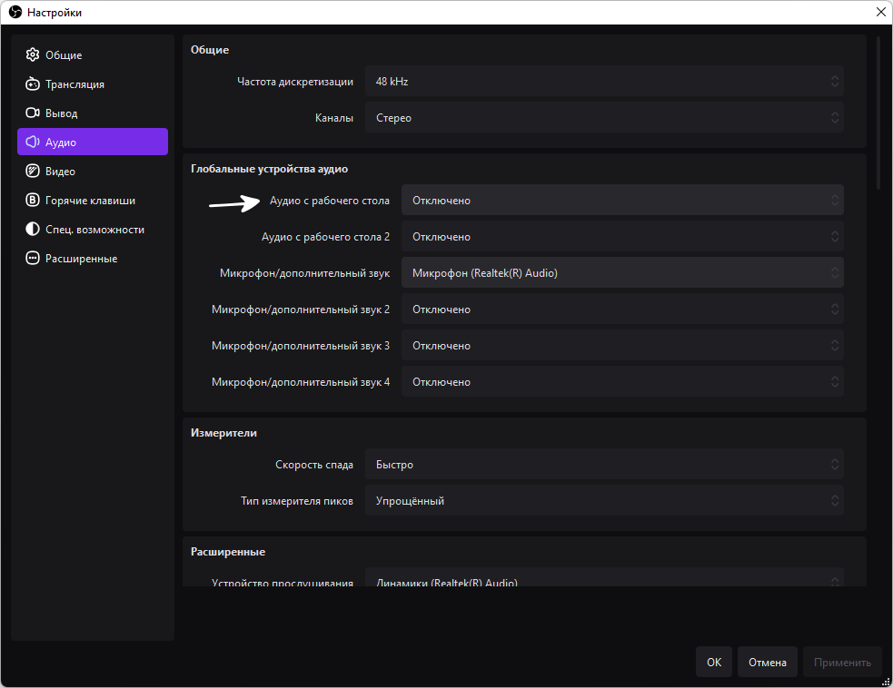<figcaption></figcaption></figure>

Добавьте новый источник `Захват выходного аудиопотока процессов`, можно назвать его `Захват аудиопотока`. Откройте его `Свойства`.

Здесь нужно поставить галочку `Захват всех аудио, КРОМЕ аудио из выбранных процессов`. В выпадающем меню `Список процессов` выберете и добавьте процессы `obs64.exe`, `obs-browser-page.exe` и `CefSharp.BrowserSubpocess.exe` (Если он есть) - эти процессы отвечают за вывод звука из источников браузера добавленных в OBS.

<figure>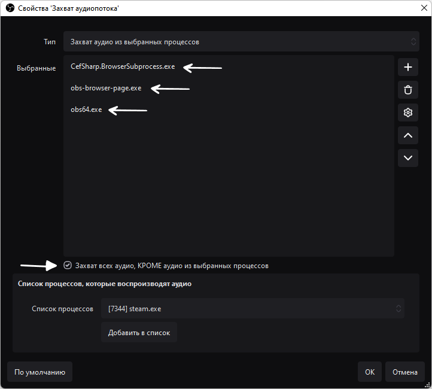<figcaption></figcaption></figure>

Если в списке процессов нет `obs-browser-page.exe` добавьте какой ни будь источник браузера с воспроизводимым звуком и переоткройте свойства `Захвата аудиопотока`.

Будьте внимательны, после исключения этих процессов из `Захвата аудиопотока`, для каждого источника браузера с выводом аудио в OBS, в микшере нужно указывать `Прослушивание и вывод` иначе ни вы, ни зрители не услышат звук из этих источников. Например для источника оповещений RutonyChat нужно будет включить `Управление аудио через OBS` и `Прослушивание и вывод` в микшере.

Затем снова откройте `Микшер аудиов OBS` и для источника `Захват аудиопотока` выберете дорожки `1` и `2`, чтобы основные звуки приложений и игр воспроизводились на обоих стримах youtube и twitch.

<figure>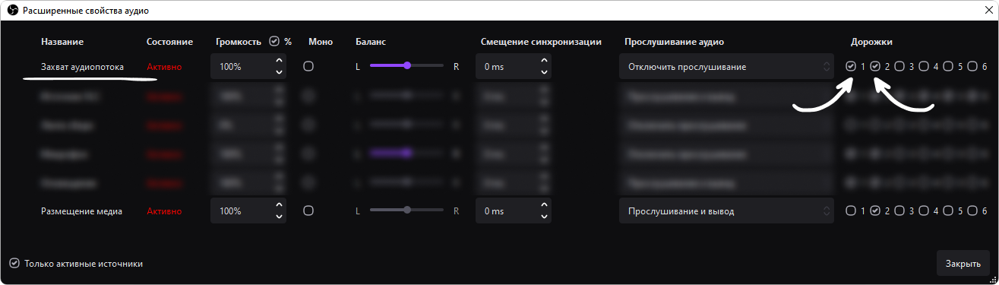<figcaption></figcaption></figure>

На этом всё, вы настроили две отдельных дорожки, дорожку `1` для youtube и дорожку `2` для twitch. Заказанная с donationalerts музыка будет выводиться только на дорожке `2` - для стрима на twitch, а `Захват аудиопотока`, со всеми остальными звуками, будет выводиться для дорожек `1` и `2` - для стримов на youtube и twitch соответственно.

&#x20;&#x20;
