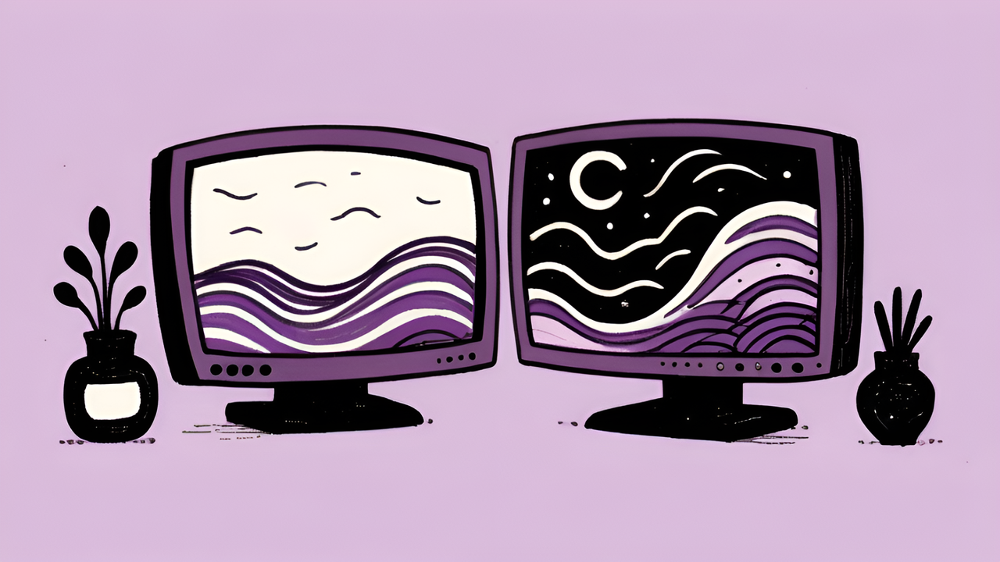
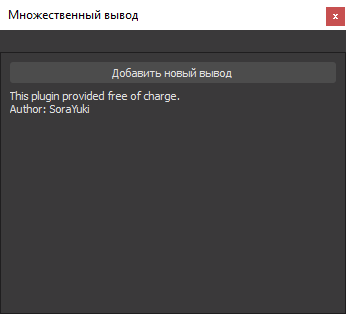
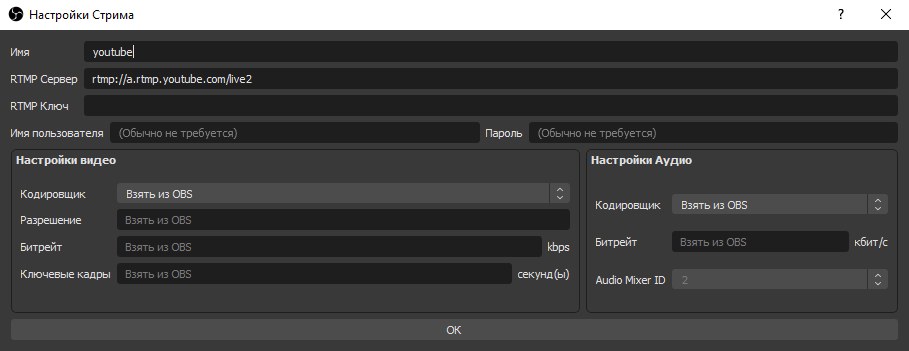
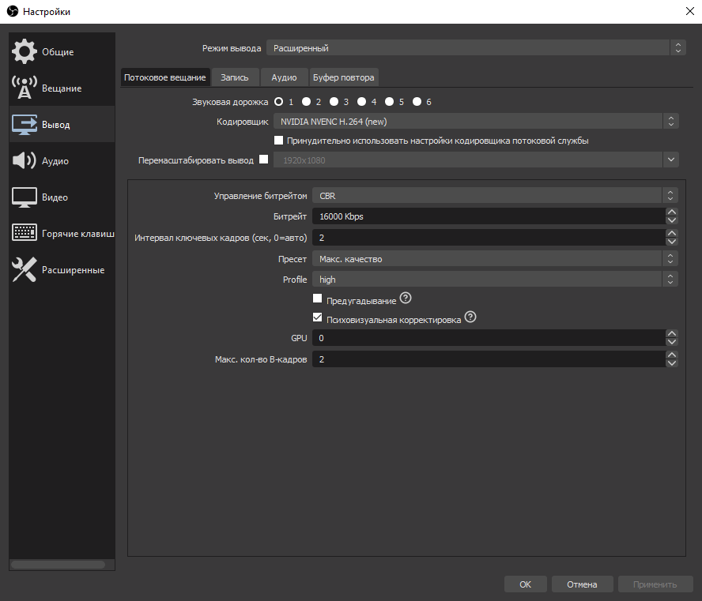
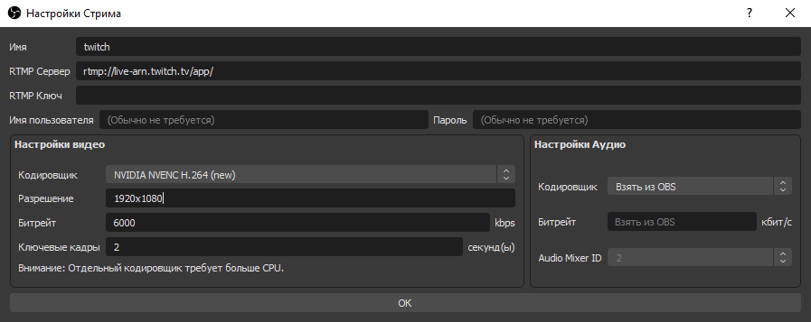
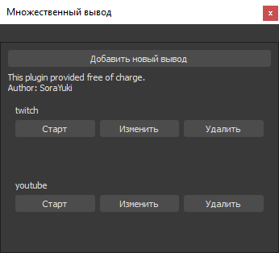

# Рестрим с разным битрейтом

<figure><figcaption></figcaption></figure>

Разные настройки кодировщика для разных стриминговых площадок необходимы для лучшего качества картинки - ведь при битрейте 6000 картинка на Twitch будет достаточно хорошей, а вот на Youtube уже довольно посредственной.


Помните, при разных настройках битрейта для каждой площадки, стрим через плагин Multiple RTMP будет сильнее нагружать ваш процессор, даже если вы стримите через кодировщик NVENC. Это может быть критично, если железо слабое.




Для начала нужно скачать свежую версию плагина. Скачиваем zip архив, папки `data` и `obs-plugins` из архива копируем в папку `OBS`.


В новых версиях плагин рестрима уже встроен в OBS, так что его можно не устанавливать и перейти к настройкам.


<figure><figcaption></figcaption></figure>

Теперь можно запустить сам OBS Studio, в нём появится новая панель `Множественный вывод`. Нажмите `Добавить новый вывод`, чтобы добавить площадку для стрима. Начнём, например, с youtube.

<figure><figcaption></figcaption></figure>

Здесь нужно указать `RTMP Сервер` и `RTMP Ключ` трансляции, их можно найти в `Творческой студии`, в [панели управления трансляцией](https://www.youtube.com/live_dashboard). Для Youtube настройки кодировщика, разрешения и битрейта я беру из основных настроек OBS.

<figure><figcaption></figcaption></figure>

Далее, добавим ещё один вывод, на этот раз для Twitch. Здесь также необходимо указать [`RTMP Сервер`](https://stream.twitch.tv/ingests/) и `RTMP` ключ трансляции, который можно найти в `Панели управления`, в разделе `Настройки` - `Канал`.

Протестировать какой `RTMP` Сервер лучше всего подходит для вашего стрима, можно небольшой программой TwitchTest.



<figure><figcaption></figcaption></figure>

Так как Twitch не позволяет стримить с битрейтом выше `6000` (8000 для компаньонов), вписываем свои настройки вещания. Выбираем кодировщик, такой же как и основной. Указываем разрешение `1920×1080`, если стримите на Youtube в разрешении `2560×1440` или `3840×2160`. Если нет, то разрешение здесь можно не указывать. Вписываем битрейт - `6000`, ключевые кадры - `2`.

<figure><figcaption></figcaption></figure>

Теперь в панели `Множественный вывод` у вас есть две площадки для стрима, каждая со своими настройками кодировщика. Таким образом можно добиться идеальной картинки на обеих платформах.
