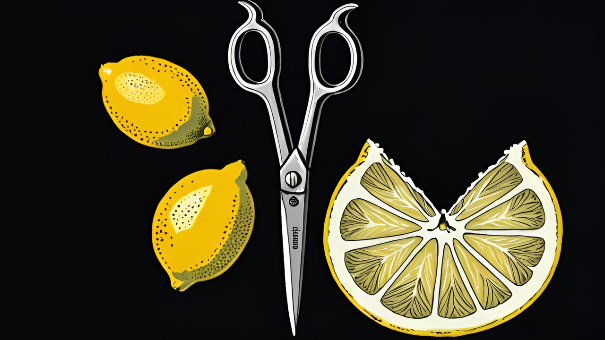
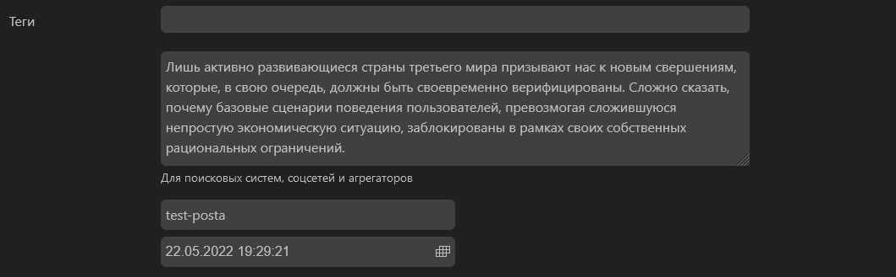
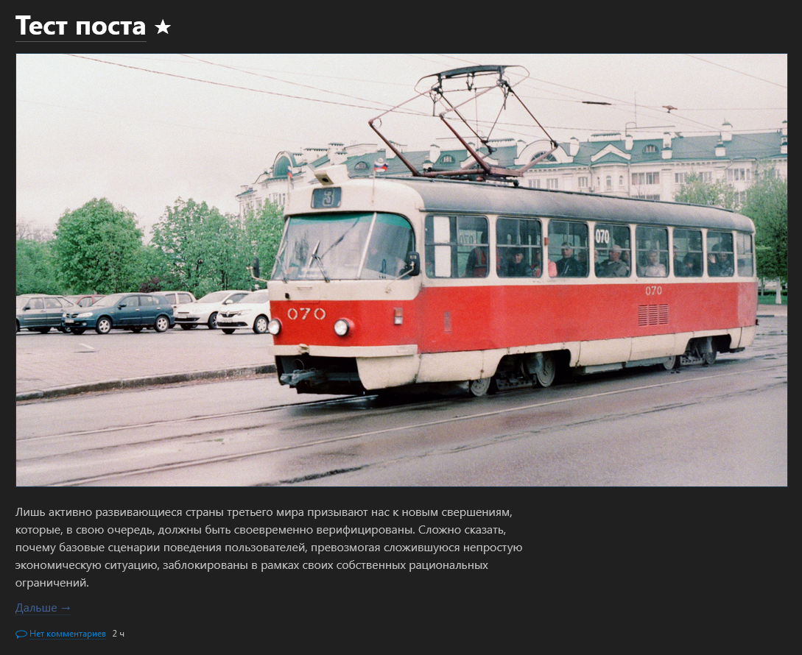
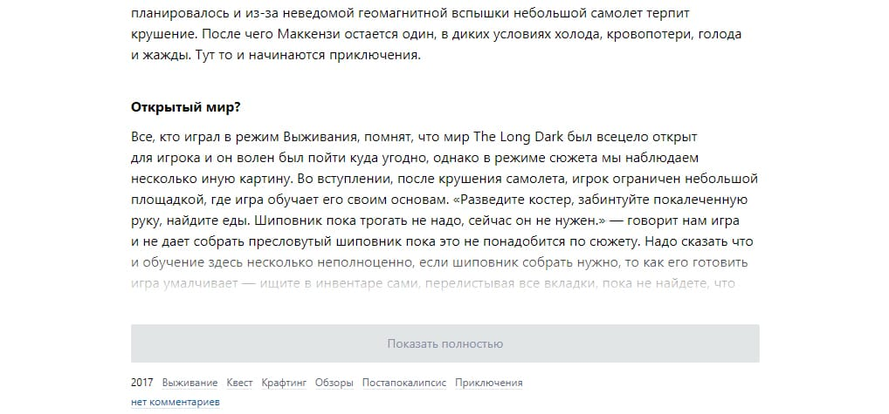

# Кат

<figure><figcaption></figcaption></figure>



Однако, некоторые авторы блогов всё же хотели бы иметь возможность скрывать посты под катом, о чём уже не раз упоминалось в обсуждениях Эгеи.

***

### Стандартный кат

Для превью будет браться первая картинка из поста, либо первая картинка добавленная, но не вставленная, непосредственно, в пост. Абзац с кратким описанием берётся из поля Краткое описание «Для поисковых систем, соцсетей и агрегаторов», в настройках url у каждого поста.

<figure><figcaption><p>Примечание: Здесь используются те же изображения, которые попадают в meta-тег <code>og:image</code> и тот же текст, который в Эгее выводится в meta-тег <code>description</code> у постов в <code>head</code>.</p></figcaption></figure>

#### Кат для избранных постов <a href="#d0-ba-d0-b0-d1-82-d0-b4-d0-bb-d1-8f-d0-b8-d0-b7-d0-b1-d1-80-d0-b0-d0-bd-d0-bd-d1-8b-d1-85-d0-bf-d0-b" id="d0-ba-d0-b0-d1-82-d0-b4-d0-bb-d1-8f-d0-b8-d0-b7-d0-b1-d1-80-d0-b0-d0-bd-d0-bd-d1-8b-d1-85-d0-bf-d0-b"></a>

Этот тип ката будет работать только в тех постах, которые были отмечены как избранные. Не избранные посты будут отображаться как обычно.

Откройте скопированный файл `note.tmpl.php` в папке `templates` - и найдите в нём строку `140` (Номер строки может отличиться от версии к версии Эгеи), а именно комментарий `<php // TEXT // ?>`.


```php
<?php // TEXT // ?>

<?php if (array_key_exists ('text', $note) and $note['text'] != '') { ?>
<div class="e2-note-text e2-text">
<?= $note['text'] ?>
</div>
<?php } ?>
```


Редактируем эту часть кода - добавляем проверку является ли пост избранным, выводим изображение для превью, выводим абзац с кратким описанием поста и кнопку «Далее» со ссылкой на полный пост. Если пост не является избранным выводим стандартное содержимое.

Достаточно скопировать этот блок кода и заменить им стандартный.

```php
<?php // TEXT // ?>

<?php // Если пост избранный // ?>
<?php if ($note['favourite?'] and $content['class'] !== 'note') { ?>
    <div class="e2-note-text e2-text">
        <?php // Старт отображения превью // ?>
        <?php if ($note['og-images']) { ?>
            <?php $i = 0; ?>
            <?php foreach ($note['og-images'] as $image): ?>
                <?php if($i++ == 0) { ?>
                    <div class="e2-text-thumbnail">
                        <div class="e2-note-thumbnail-wrapper">
                            <a href="<?= $note['href'] ?>">
                                "/>
                            </a>
                        </div>
                    </div>
                <?php } ?>
            <?php endforeach ?>
        <?php } ?>
        <?php // Конец отображения превью // ?>

        <?php // Старт отображения сокращенного текста // ?>
        <?php if (array_key_exists ('snippet-text', $note) and $note['snippet-text'] != '') { ?>
            <p><?= $note['snippet-text'] ?></p>
        <?php } ?>
        <?php // Конец отображения сокращенного текста // ?>

        <?php // Старт вывода ссылки // ?>
        <p class="e2-text-readmore"><a href="<?= $note['href'] ?>"><?= _S ('nm--read-next') ?> &rarr;</a></p>
        <?php // Конец вывода ссылки // ?>
    </div>

<?php // Если пост не избранный // ?>
<?php } else { ?>
    <?php if (array_key_exists ('text', $note) and $note['text'] != '') { ?>
        <div class="e2-note-text e2-text">
            <?= $note['text'] ?>
        </div>
    <?php } ?>
<?php } ?>
```

При желании здесь можно поменять местами изображение превью, текст описания поста, ссылку на полную запись. Для понимания эти части я отметила комментариями.

#### Кат для всех постов <a href="#d0-ba-d0-b0-d1-82-d0-b4-d0-bb-d1-8f-d0-b2-d1-81-d0-b5-d1-85-d0-bf-d0-be-d1-81-d1-82-d0-be-d0-b2" id="d0-ba-d0-b0-d1-82-d0-b4-d0-bb-d1-8f-d0-b2-d1-81-d0-b5-d1-85-d0-bf-d0-be-d1-81-d1-82-d0-be-d0-b2"></a>

Если нужно чтобы все посты на главной странице блога прятались под катом, достаточно в том же самом коде, который редактировали выше, изменить строку:

```php
<?php if ($note['favourite?'] and $content['class'] !== 'note') { ?>
```

Убрав проверку является ли пост избранным.

```php
<?php if ($content['class'] !== 'note') { ?>
```

#### Стили превью <a href="#d1-81-d1-82-d0-b8-d0-bb-d0-b8-d0-bf-d1-80-d0-b5-d0-b2-d1-8c-d1-8e" id="d1-81-d1-82-d0-b8-d0-bb-d0-b8-d0-bf-d1-80-d0-b5-d0-b2-d1-8c-d1-8e"></a>

В папке `styles`, шаблона `spoiler`, создайте файл `overrides.css` и добавьте стили отображения превью. Если нужно, отредактируйте внешний вид по желанию.

```css
/* Thumbnail */

.e2-text-thumbnail {
    margin-bottom: 1.25rem;
    margin-top: 1.25rem;
}
.e2-text-thumbnail .e2-note-thumbnail-wrapper {
    position: relative;
    overflow: hidden;
}
.e2-text-thumbnail .e2-note-thumbnail-wrapper a {
    display: inline-block;

    border: 1px solid var(--linkUnderlineColor);
}
.e2-text-thumbnail .e2-note-thumbnail-wrapper a.hover,
.e2-text-thumbnail .e2-note-thumbnail-wrapper a:hover {
    border-color: var(--hoverColor)
}
.e2-text-thumbnail .e2-note-thumbnail-wrapper img {
    display: block;

    max-width: 100%;
}
```

Вид ссылки «Далее» можно изменить добавив стили к классу `.e2-text-readmore` и `.e2-text-readmore a`.

<figure><figcaption></figcaption></figure>

Готово. Работает автоматически, подтягивает первую картинку и описание из поля `Краткое описание` поста. Пример шаблона `spoiler` из этой заметки, с катом для избранных постов, добавила для вас на GitHub. Можно скачать, поставить и пользоваться (Актуально для версии Эгеи `2.10`, сборка `3860`). Либо сделать всё самостоятельно.



### JS кат

Также кат в Эгее можно сделать с использованием скрипта `readmore.js`. Особенность `readmore.js` в том, что раскрывать длинные записи для чтения можно без перезагрузки страницы и новых вкладок в браузере.



<figure><figcaption></figcaption></figure>

Скачайте скрипт readmore. js с GitHub и поместите файл `readmore.min.js` в папку `js`, которую нужно создать в корне вашего шаблона Эгеи, например в корне стандартного шаблона `plain`:

```shell
themes\plain\js\readmore.min.js
```

После, создадим файл `template.js` в папке `js` шаблона `plain`, в нём будем настраивать сам скрипт. Добавим в созданный файл настройки, полный список которых можно посмотреть на странице скрипта `readmore.js` на GitHub.

```javascript
$('.e2-note-short').readmore({
    speed: 75, // Скорость раскрытия ката
    collapsedHeight: 1250, // Длинна заметки после которой будет добавлен кат
    moreLink: '<div class="more"><a class="morelink" href="#">Показать полностью</a></div>', // Классы кнопки раскрытия ката
    lessLink: '' // Классы кнопки скрытия ката
});
```

Теперь нужно добавить класс `.e2-note-short`, благодаря которому будет добавляться кат к вашим записям, для этого нужно скопировать файл из:

```shell
system\theme\templates\notes.tmpl.php
```

И поместить в папку `templates` шаблона:

```shell
themes\plain\templates\notes.tmpl.php
```

Откроем скопированный `notes.tmpl.php`, где добавим к тегу `article` класс `e2-note-short` обернув его `php` параметром, чтобы кат не работал на отдельной странице с записью, а только в ленте постов на главной.

```php
<article class="<?php if ($content['class'] != 'note') { ?>e2-note-short<?php } ?>">
```

Далее, в папке `styles` шаблона создадим файл `overrides.css` где будут стили кнопки ката. В дальнейшем в этот css можно добавлять любые собственные стили, без конфликта с основными стилями шаблона Эгеи.

```css
themes\plain\styles\overrides.css
```

Добавим стили ката, при желании их можно отредактировать на свое усмотрение.

```css
.more {
    position: relative;
}
.more::before {
    content: "";
    background: -moz-linear-gradient(top, rgba(255,255,255,0) 40%, rgba(255,255,255,1) 80%);
    background: -webkit-linear-gradient(top, rgba(255,255,255,0) 40%,rgba(255,255,255,1) 80%);
    background: linear-gradient(to bottom, rgba(255,255,255,0) 40%,rgba(255,255,255,1) 80%);
    filter: progid:DXImageTransform.Microsoft.gradient( startColorstr='#00ffffff', endColorstr='#ffffff',GradientType=0 ); 
    pointer-events: none;
    position: absolute;
    display: block;
    height: 150px;
    width: 100%;
    top: -150px;
    left: 0;
}
a.morelink {
    -webkit-border-radius: 2px;
    -moz-border-radius: 2px;
    border-radius: 2px;
    background: #f1f3f4;
    text-align: center;
    max-width: 720px;
    color: #8890a7;
    font-size: 14px;
    display: block;
    width: 100%;
    margin-bottom: 1em;
    border-bottom: 0;
    padding: 10px;
}
a.morelink:hover {
    background: #e2e5e6;
    color: #8890a7;
}
```

Теперь необходимо подключить все созданные файлы непосредственно в шаблон, для этого копируем `main.tmpl.php` из основных файлов Эгеи:

```shell
system\theme\templates\main.tmpl.php
```

В папку `templates` шаблона:

```shell
themes\plain\templates\main.tmpl.php
```

Отредактируем `main.tmpl.php` добавив:

```php
<?php _JS ('readmore.min') ?>
<?php _JS ('template') ?>
```

После основных скриптов шаблона:

```php
<?php _JS ('main') ?>
```

Всё, кат добавлен в Эгею. Возможно где-то придется отредактировать стили по ситуации, подобрать оптимальную длину заметки после которой кат будет скрывать запись, и тому подобное. Стандартный шаблон plain здесь используется в качестве примера, намного лучше сделать его копию и переименовать, дабы при последующих обновлениях Эгеи ничего не перезаписалось.
