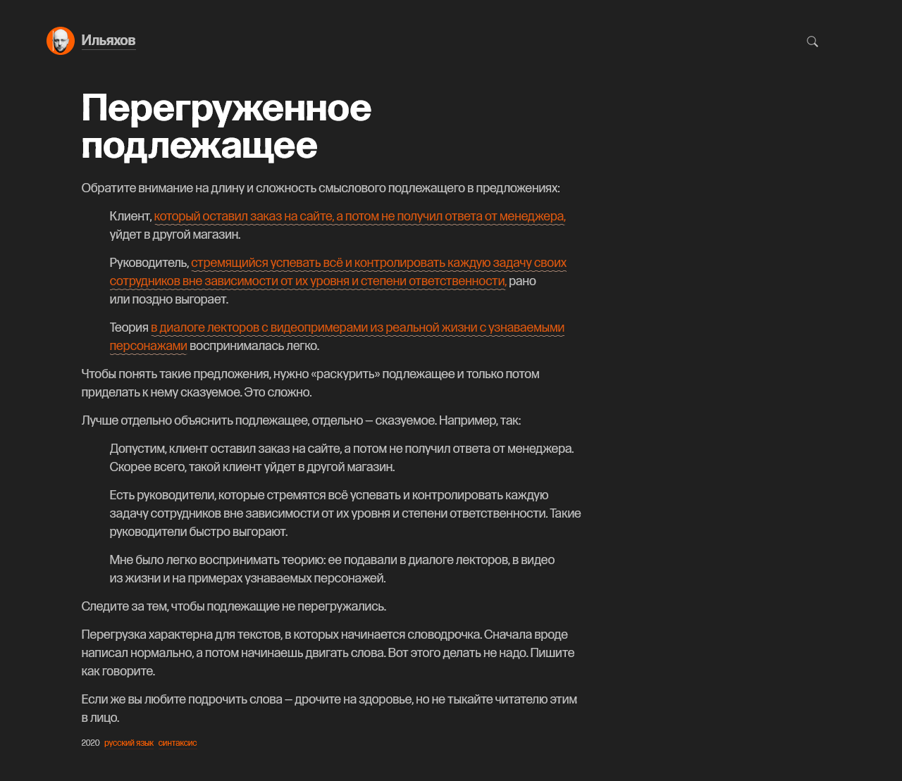

# Редактор

### Волнистые подчёркивания

Красные волнистые подчёркивания в тексте, как [в блоге](https://maximilyahov.ru/blog/all/simple-subject/) у Максима Ильяхова, для Эгеи можно добавить небольшим `css` кодом.

<figure><figcaption></figcaption></figure>

Добавьте стили в `overrides.css`:

```css
.e2-text .line-red {
    color: rgb(218, 87, 15);
    font-style: normal;
    background: url("./images/line-red.svg") 0 100% repeat-x;
    border-radius: .2em;
    padding-bottom: 2px;
    margin: unset;
}

.e2-text .line-green {
    color: rgb(12, 145, 30);
    font-style: normal;
    background: url("./images/line-green.svg") 0 100% repeat-x;
    border-radius: .2em;
    padding-bottom: 2px;
    margin: unset;
}
```

Скачайте `svg` для подчёркиваний, зелёного и красного. Создайте папку `images` в папке `styles` и положите туда оба `svg` изображения.



```cmd
../themes/plain/styles/images
```

Всё, теперь в редакторе можно применять стили подчёркивания к тексту - `span` с классом `line-red` для красного и `line-green` для зелёного.


```html
Зло – <span class="line-red">это зло</span>, Стрегобор, – серьезно сказал ведьмак, вставая. – Меньшее, большее, среднее – <span class="line-green">все едино</span>, пропорции условны, а границы размыты.
```


### Маргиналии

Заметки на полях, или же маргиналии, добавить в Эгею можно небольшим CSS кодом. Добавьте его в `overrides.css`.

```css
@media screen and (min-width: 1050px) {
    .e2-text .aside {
        position: relative;
        text-align: left;
        max-width: 200px;
        margin-left: 4%;
        margin-top: .15em;
        float: right;
        clear: right;
    }
}
.e2-text .aside {
    line-height: 1.4;
    font-size: 0.875em;
    color: #4A4A4A;
}
```

Теперь, при написании очередной статьи в блог, достаточно использовать эгеевский язык разметки.

```md
.aside Текст заметки на полях.
```

Этот тег добавит заметку справа от следующего за ним абзаца.
