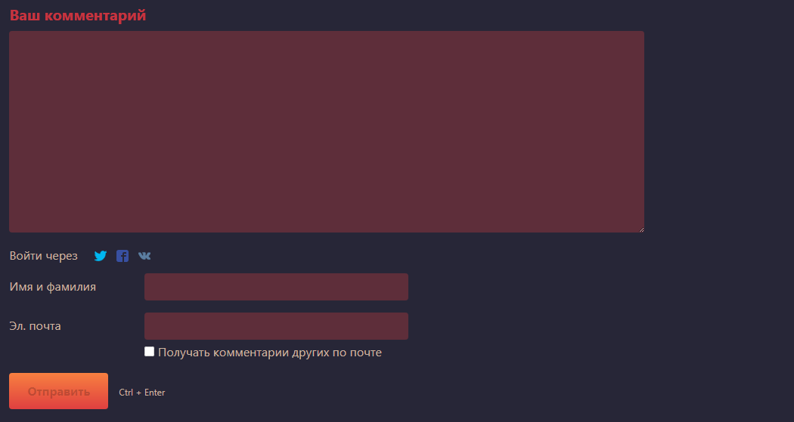

# Шаблон

### Создание своего шаблона

1. Откройте папку `system\themes\plain`.
2. Скопируйте эту папку в `user\themes`. Если папка `themes` отсутствует в `user`, создайте ее.
3. Переименуйте скопированную папку на свое усмотрение, например, в `custom`.
4. Откройте файл `theme-info.php` в папке `custom` любым редактором кода.
5. В файле `theme-info.php` найдите строку `index` и укажите любой порядковый номер шаблона, например `99`. В строке `display_name` укажите имя шаблона на русском и английском.

```php
<?php return array (

  'index' => 99,

  'display_name' => array (
    'en' => 'Custom',
    'ru' => 'Кастом',
  ),

  'colors' => array (
    'background' => '#fff',
    'headings' => '#000',
    'text' => '#000',
    'link' => '#0060a0',
  ),

  'meta_viewport' => 'width=device-width, initial-scale=1',
  'supports_dark_mode' => true,

); ?>
```

<figure><figcaption></figcaption></figure>

В папке темы также существует несколько папок из которых Эгея подхватывает скрипты, стили, изображения и файлы разметки:

<table data-header-hidden data-full-width="false"><thead><tr><th width="332"></th><th></th></tr></thead><tbody><tr><td><code>user\themes\custom\images</code></td><td>Изображения</td></tr><tr><td><code>user\themes\custom\js</code></td><td>JS скрипты</td></tr><tr><td><code>user\themes\custom\src</code></td><td>Исходные sass файлы стилей</td></tr><tr><td><code>user\themes\custom\styles</code></td><td>CSS стили</td></tr><tr><td><code>user\themes\custom\templates</code></td><td>PHP файлы шаблона</td></tr></tbody></table>

Если файлов в папках нет, они будут подхватываться из стандартной темы Эгеи, которая находится по пути `system\themes`.

### Стили

Для того, чтобы добавить ваши стили в Эгею, откройте папку с шаблоном и создайте файл стилей `overrides.css` в папке `styles` шаблона. Это позволит безопасно дополнять свою тему стилями, не рискуя потерять внесенные изменения после очередного обновления.


Файл `overrides.css` работает не только в пользовательских, но и в стандартных шаблонах. Дополнительно ничего подключать не нужно, Эгея подхватывает этот `css` файл автоматически.


### Разбор основных шаблонов

Теперь стоит подробнее разобрать содержимое папки `templates`, для наглядности того, как выглядит тот или иной элемент в живую, я добавила соответствующие файлам скриншоты.


Эта часть статьи устарела и не всё написанное в ней отражает действительность, так как Эгея периодически обновляется. Тем не менее она всё равно может оказаться полезной.


<figure><figcaption><p><code>user-picture.tmpl.php</code> — Аватар блога.</p></figcaption></figure>

<figure><figcaption><p><code>author-menu.tmpl.php</code> — Меню автора.</p></figcaption></figure>

<figure><figcaption><p><code>search-heading.tmpl.php</code> — Форма поиска.</p></figcaption></figure>

<figure><figcaption><p><code>notes.tmpl.php</code> — Пост.</p></figcaption></figure>

<figure><figcaption><p><code>pages.tmpl.php</code> — Навигация между постами.</p></figcaption></figure>

<figure><figcaption><p><code>comments-heading.tmpl.php</code> — Заголовок списка комментариев с счетчиком их количества.</p></figcaption></figure>

<figure><figcaption><p><code>comments.tmpl.php</code> — Список комментариев.</p></figcaption></figure>

<figure><figcaption><p><code>form-comment.tmpl.php</code> — Форма комментария.</p></figcaption></figure>

<figure><figcaption><p><code>form-comment-reply.tmpl.php</code> — Форма ответа на комментарий.</p></figcaption></figure>

<figure><figcaption><p><code>popular.tmpl.php</code> — Блок популярных постов.</p></figcaption></figure>

<figure><figcaption><p><code>pages-earlier.tmpl.php</code> — Кнопка к постам «Ранее».</p></figcaption></figure>

<figure><figcaption><p><code>pages-later.tmpl.php</code> — Кнопка к постам «Позднее».</p></figcaption></figure>

<figure><figcaption><p><code>notes-list.tmpl.php</code> — Список всех постов блога.</p></figcaption></figure>

<figure><figcaption><p><code>heading.tmpl.php</code> — Заголовки на большинстве страниц.</p></figcaption></figure>

<figure><figcaption><p><code>form-note.tmpl.php</code> — Форма публикации поста.</p></figcaption></figure>

<figure><figcaption><p><code>form-note-delete.tmpl.php</code> — Форма удаления поста.</p></figcaption></figure>

<figure><figcaption><p><code>form-note-publish.tmpl.php</code> — Кнопка публикации поста.</p></figcaption></figure>

<figure><figcaption><p><code>drafts.tmpl.php</code> — Список черновиков.</p></figcaption></figure>

<figure><figcaption><p><code>form-preferences.tmpl.php</code> — Форма общих настроек блога.</p></figcaption></figure>

<figure><figcaption><p><code>form-password.tmpl.php</code> — Форма смены админ-пароля.</p></figcaption></figure>

<figure><figcaption><p><code>form-database.tmpl.php</code> — Форма подключения к базе данных.</p></figcaption></figure>

<figure><figcaption><p><code>sessions.tmpl.php</code> — Список текущих сессий.</p></figcaption></figure>

<figure><figcaption><p><code>form-install.tmpl.php</code> — Форма установки Эгеи.</p></figcaption></figure>

<figure><figcaption><p><code>form-login.tmpl.php</code> — Форма авторизации.</p></figcaption></figure>

<figure><figcaption><p><code>tags.tmpl.php</code> — Список всех тегов блога.</p></figcaption></figure>

<figure><figcaption><p><code>form-tag.tmpl.php</code> — Форма редактирования тега.</p></figcaption></figure>

<figure><figcaption><p><code>form-tag-delete.tmpl.php</code> — Форма удаления тега.</p></figcaption></figure>

<figure><figcaption><p><code>tags-menu.tmpl.php</code> — Меню избранных тегов.</p></figcaption></figure>

<figure><figcaption><p><code>form-search.tmpl.php</code> — Форма поиска на странице поиска.</p></figcaption></figure>

<figure><figcaption><p><code>login-element.tmpl.php</code> — Кнопка авторизации в футере.</p></figcaption></figure>

<figure><figcaption><p><code>form-password-reset-email.tmpl.php</code> — Страница сброса пароля.</p></figcaption></figure>

<figure><figcaption><p><code>layout.tmpl.php</code> — Основная разметка шаблона внутри body, здесь подключаются другие части шаблона.</p></figcaption></figure>

`main.tmpl.php` — Разметка внутри `html`, здесь подключается `head.tmpl.php` содержащий метатеги, сам `layout.tmpl.php`, `js` и `css`.

Эти файлы можно копировать в папку `templates` своей темы и редактировать на свой вкус.

***

Подключить свою собственную часть шаблона можно создав файл типа `name.tmpl.php` в папке `templates` и затем вызвать его в любом другом месте или в `layout.tmpl.php`. Например, можно создать файл `menu.tmpl.php` со своим меню и ссылками на соц-сети, сверстанными на `html` и `css`, и вызвать его в `layout.tmpl.php` специальным макросом. Илья Бирман в справке к Эгее пишет:

> Шаблон может вызывать другие шаблоны для отображения конкретного фрагмента: `_T ()` — вызывает шаблон по имени. (…) Шаблон `layout.tmpl.php` «срабатывает» потому, что `main.tmpl.php` вызывает его для формирования тела страницы.

Так, чтобы вывести содержимое файла `menu.tmpl.php` где-нибудь на сайте, достаточно небольшого кода:

```php
<?php _T ('menu') ?>
```

К слову, если вам нужно вывести часть шаблона, скажем, только на главной странице, но не на странице поста, оберните код вывода следующим уточнением:

```php
<?php if ($content['class'] == 'frontpage') { ?>
    <?php _T ('menu') ?>
<?php } ?>
```

Или, если нужно вывести эту часть шаблона только на странице поста:

```php
<?php if ($content['class'] == 'note') { ?>
   <?php _T ('menu') ?>
<?php } ?>
```

`JS` и `CSS` в тему Эгеи тоже подключаются специальными макросами. Для наглядности откройте стандартный `main.tmpl.php` и посмотрите в конец файла, после закрывающего тега `body`:

```php
<?php _CSS ('main') ?>
<?php _JS ('main') ?>
```

Здесь подхватываются `./js/main.js` и `./styles/main.css` из папки темы, или из стандартной темы, если нет соответствующих файлов. По такому принципу можно добавить, например, скрипт `bootstrap.min.js` в папку `js` и подключить его кодом:

```php
<?php _JS ('bootstrap.min') ?>
```

Таким образом можно редактировать отдельные части шаблона Эгеи при создании своей темы, подключать стили и скрипты. Также, для более полной информации, рекомендую ознакомиться с официальной документацией по темам оформления Эгеи.
